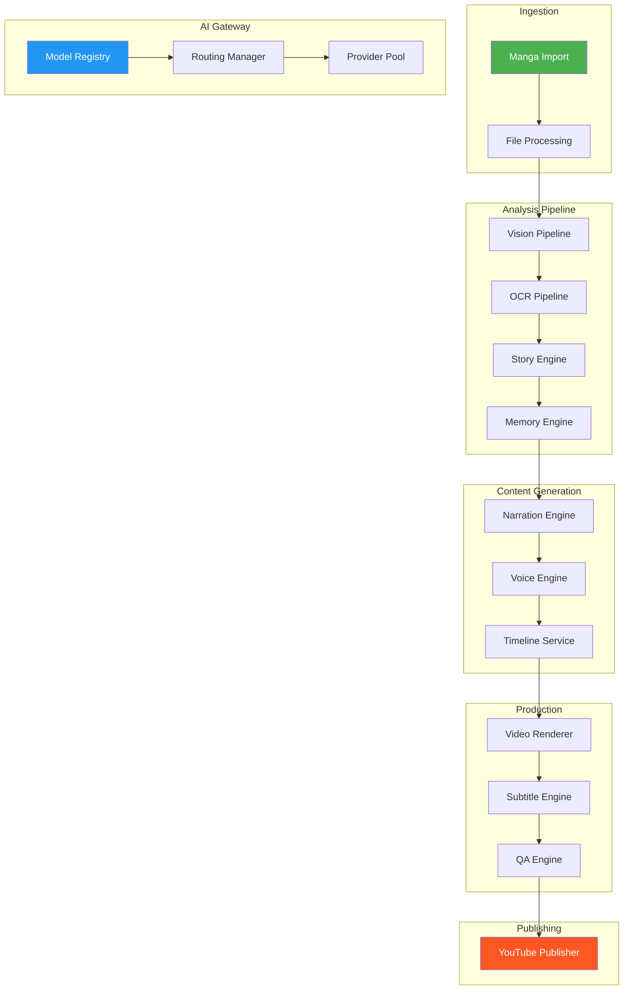
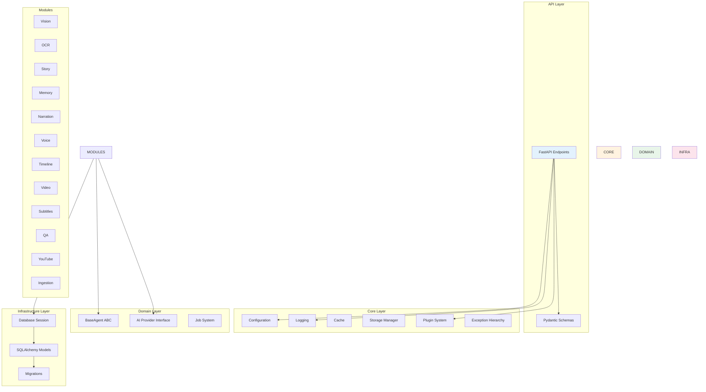
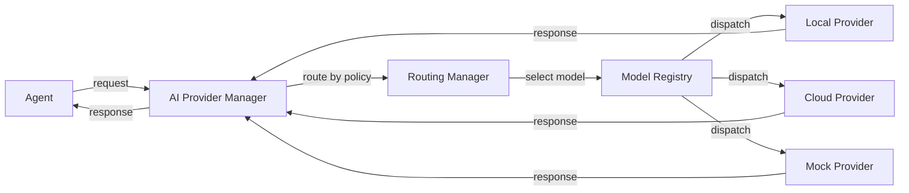
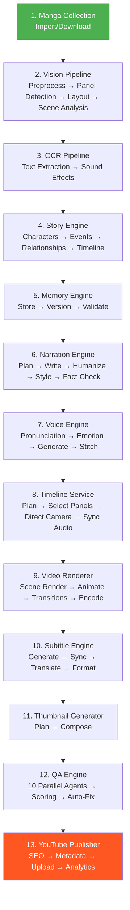
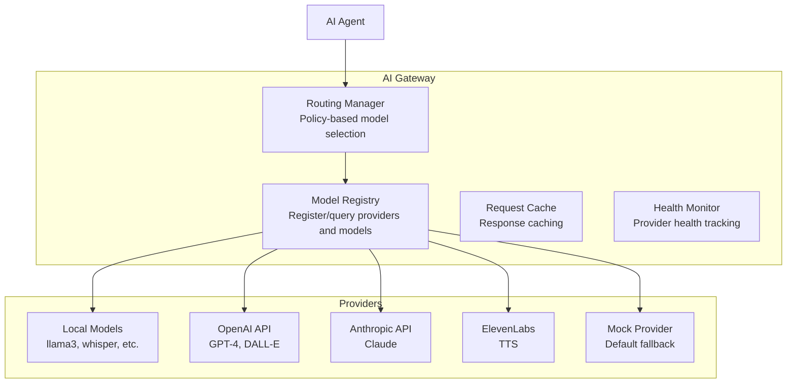

<div align="center">

# AMRAS

### AI Manga Recap Automation System

**Convert complete manga series into high-quality, human-like YouTube recap videos with minimal manual intervention.**

[](https://github.com/DevKaranJ/AMRAS-MODEL/actions/workflows/ci.yml)
[](https://www.python.org/downloads/)
[](LICENSE)
[](https://github.com/astral-sh/ruff)
[](https://mypy-lang.org/)

[Features](#features) · [Architecture](#architecture-overview) · [Installation](#installation-guide) · [API Reference](#api-reference) · [Development](#development-workflow) · [Contributing](#contributing)

</div>

---

## Table of Contents

- [Project Overview](#project-overview)
- [Features](#features)
- [Architecture Overview](#architecture-overview)
- [Technology Stack](#technology-stack)
- [Quick Start (Automated)](#quick-start-automated)
- [Installation Guide](#installation-guide)
- [Configuration](#configuration)
- [API Reference](#api-reference)
- [Project Structure](#project-structure)
- [Pipeline Overview](#pipeline-overview)
- [AI Models & Gateway](#ai-models--gateway)
- [Desktop Application](#desktop-application)
- [Testing](#testing)
- [Development Workflow](#development-workflow)
- [Deployment](#deployment)
- [Roadmap](#roadmap)
- [Contributing](#contributing)
- [License](#license)
- [Acknowledgements](#acknowledgements)

---

## Project Overview

AMRAS (AI Manga Recap Automation System) is a production-grade platform that automates the end-to-end workflow of transforming manga series into YouTube recap videos. The system handles everything from manga ingestion and OCR to AI-powered story understanding, narration, voice synthesis, video rendering, and publishing.

### Why AMRAS?

Manually creating manga recap videos requires hours of reading, summarizing, recording narration, editing video, and publishing. AMRAS automates this entire pipeline using AI agents, achieving in minutes what would take a human editor hours.

### Core Capabilities

- **Automated Manga Ingestion** -- Import CBZ, PDF, folder, and remote manga sources
- **Vision Pipeline** -- Panel detection, layout analysis, character/object recognition
- **OCR & Text Extraction** -- Speech bubbles, sound effects, narration text
- **AI Story Understanding** -- Multi-agent story analysis, character tracking, event extraction
- **Memory Engine** -- Persistent, versioned story knowledge base
- **Narration Generation** -- AI-written scripts with humanization and fact-checking
- **Voice Synthesis** -- Emotion-aware text-to-speech with audio stitching
- **Timeline & Animation** -- Camera direction, panel selection, motion planning
- **Video Rendering** -- Scene composition, transitions, encoding, quality assurance
- **Subtitle Generation** -- Multi-language subtitles with localization
- **Publishing** -- YouTube upload, SEO optimization, analytics tracking
- **Desktop Application** -- Electron-based GUI for monitoring and control

### High-Level Architecture



---

## Features

### Manga Collection & Ingestion
- CBZ/ZIP archive import
- PDF import with page extraction
- Folder structure import
- Remote manga download with retry logic
- Metadata extraction and validation
- Batch import support

### Vision Pipeline
- Image preprocessing (deskew, denoise, contrast enhancement)
- Panel detection and segmentation
- Layout analysis
- Character detection and recognition
- Object detection
- Scene analysis
- Confidence scoring

### OCR & Text Extraction
- Tesseract-based text recognition
- Speech bubble text extraction
- Sound effect detection
- Narration text identification
- Multi-language support

### AI Story Understanding
- Multi-agent story analysis
- Character extraction and profiling
- Event extraction and sequencing
- Relationship mapping
- Timeline construction
- Location and organization tracking
- Knowledge base entry generation

### Memory Engine
- Persistent story knowledge storage
- Versioned memory with conflict resolution
- Character memory profiles
- Relationship tracking
- Event memory with temporal ordering
- World knowledge graphs
- Embedding-based retrieval
- Audit logging

### Narration Generation
- Script planning with scene decomposition
- Narrative writing with style enforcement
- Humanization passes for natural flow
- Context-aware narration
- Consistency checking
- Engagement optimization
- Fact verification against story data
- Multi-pass quality assurance

### Voice Synthesis
- Emotion-aware TTS generation
- Pronunciation dictionary support
- Audio timing alignment
- Multi-segment audio stitching
- Audio normalization
- Quality reporting
- Timestamp indexing

### Timeline & Animation
- Scene planning and decomposition
- Panel selection algorithms
- Camera direction and motion paths
- Scene composition
- Audio synchronization
- Reading flow optimization
- Transition design
- Motion planning

### Video Rendering
- Scene rendering with animations
- Transition effects
- Video composition
- Hardware-accelerated encoding
- Resource management
- Render quality assurance

### Subtitle Generation
- Multi-format export (SRT, VTT, ASS)
- Audio synchronization
- Translation support
- Localization profiles
- Caption styling
- Version management

### Publishing & Analytics
- YouTube video upload
- SEO optimization (titles, descriptions, tags)
- Thumbnail generation and variants
- Playlist management
- Scheduling
- Analytics tracking
- Publishing QA

### Quality Assurance
- 10 parallel QA agents for cross-module validation
- Auto-fix engine for common issues
- Manual review workflow
- Performance monitoring
- Security scanning
- Approval history tracking

### Desktop Application
- Electron-based GUI
- Real-time dashboard with auto-refresh
- Project management
- Job monitoring
- System health visualization

---

## Architecture Overview

AMRAS follows **Clean Architecture** principles with a plugin-based modular design.

### Architectural Principles

| Principle | Implementation |
|---|---|
| **Single Responsibility** | Each agent handles one specific task |
| **Open/Closed** | Plugin system allows adding new agents without modifying core |
| **Interface Segregation** | `BaseAgent` ABC defines minimal interface |
| **Dependency Inversion** | Agents depend on abstractions, not implementations |
| **Separation of Concerns** | Clear layer boundaries between API, domain, and infrastructure |

### Layer Architecture



### Module System

Each domain module follows a consistent pattern:

```
module/
  __init__.py
  agents.py          # Specialized AI agents
  engine.py          # Pipeline orchestration
  exceptions.py      # Module-specific errors
```

Modules communicate through:
- **Direct method calls** for sequential pipeline steps
- **Shared database models** for persistent state
- **AI Gateway** for model routing and provider management

### Plugin Architecture

```python
# All agents implement BaseAgent
class BaseAgent(ABC):
    name: str
    description: str
    version: str

    async def execute(self, context: JobContext) -> dict
    async def validate(self, input_data: dict) -> bool
    async def health_check(self) -> bool
    async def rollback(self, context: JobContext) -> bool
```

### AI Gateway

The AI Gateway provides provider-agnostic access to LLM and TTS services:



### Database

- **ORM:** SQLAlchemy 2.0 with async support
- **Migrations:** Alembic with async engine
- **Development:** SQLite + aiosqlite
- **Production:** PostgreSQL + asyncpg
- **Models:** 100+ models across 13 domains

---

## Technology Stack

### Backend

| Component | Technology |
|---|---|
| Language | Python 3.12+ |
| Web Framework | FastAPI |
| ASGI Server | Uvicorn |
| ORM | SQLAlchemy 2.0 |
| Migrations | Alembic |
| Validation | Pydantic v2 |
| Settings | pydantic-settings |
| Logging | structlog |
| DI | dependency-injector |
| Image Processing | Pillow, pdf2image |

### Frontend / Desktop

| Component | Technology |
|---|---|
| Framework | React 18 + TypeScript |
| Desktop Shell | Electron 26 |
| Build Tool | Vite |
| HTTP Client | Axios / Fetch |

### Database

| Environment | Database |
|---|---|
| Development | SQLite + aiosqlite |
| Production | PostgreSQL + asyncpg |
| Testing | In-memory SQLite |

### AI Models

| Capability | Providers |
|---|---|
| LLM (Text Generation) | Local (llama3), OpenAI, Anthropic |
| TTS (Voice) | Local, ElevenLabs, Azure |
| Vision | Local models, cloud APIs |

### OCR

| Engine | Usage |
|---|---|
| Tesseract | Primary text extraction |
| Custom | Specialized manga text recognition |

### Rendering

| Component | Tool |
|---|---|
| Video Encoding | FFmpeg |
| Audio Processing | FFmpeg |
| Image Processing | Pillow |

### Containerization

| Tool | Purpose |
|---|---|
| Docker | Application packaging |
| Docker Compose | Multi-service orchestration |

### Testing

| Tool | Purpose |
|---|---|
| pytest | Test framework |
| pytest-asyncio | Async test support |
| pytest-cov | Coverage reporting |
| httpx | Async HTTP testing |

### Code Quality

| Tool | Purpose |
|---|---|
| Ruff | Linting + formatting |
| mypy | Static type checking |
| Pre-commit | Git hooks |

### CI/CD

| Platform | Purpose |
|---|---|
| GitHub Actions | Automated testing, linting, type checking |
| Codecov | Coverage reporting |

---

## Quick Start (Automated)

The fastest way to get AMRAS running is the interactive setup script, which
checks prerequisites, installs dependencies, configures your `.env`, runs
migrations, and launches the server — all in one go.

```bash
git clone https://github.com/DevKaranJ/AMRAS-MODEL.git
cd AMRAS-MODEL
python setup.py
```

The script will guide you through:
- Verifying Python 3.12+, Poetry, FFmpeg, and Tesseract are installed
- Generating a secure API key or using your own
- Choosing SQLite (development) or PostgreSQL (production)
- Configuring the AI provider (local mock, OpenAI, Anthropic, etc.)
- Running database migrations
- Optionally running the test suite
- Starting the server at `http://localhost:8000`

> **Manual setup?** Continue to the [Installation Guide](#installation-guide) below.

---

## Installation Guide

### Prerequisites

- **Python 3.12+** -- [Download](https://www.python.org/downloads/)
- **Poetry 2.0+** -- [Install](https://python-poetry.org/docs/#installation)
- **FFmpeg** -- [Install](https://ffmpeg.org/download.html) (for video/audio processing)
- **Tesseract OCR** -- [Install](https://github.com/tesseract-ocr/tesseract) (for text extraction)
- **Git** -- [Install](https://git-scm.com/downloads)
- **Node.js 18+** -- [Install](https://nodejs.org/) (for desktop app only)

### Clone

```bash
git clone https://github.com/DevKaranJ/AMRAS-MODEL.git
cd AMRAS-MODEL
```

### Install Dependencies

```bash
poetry install
```

### Setup Environment

```bash
cp .env.example .env
# Edit .env with your configuration (see Configuration section)
```

### Database Migration

```bash
poetry run alembic upgrade head
```

### Verify Installation

```bash
# Run linting
poetry run ruff check .
poetry run ruff format --check .

# Run type checking
poetry run mypy app

# Run tests
poetry run pytest
```

### Start the Server

```bash
poetry run uvicorn app.api.main:app --reload
```

The API is available at `http://localhost:8000`. Interactive docs at `http://localhost:8000/docs`.

---

## Configuration

AMRAS uses a hierarchical configuration system powered by `pydantic-settings`. Configuration is loaded from `.env` files with nested delimiter `__`.

### Environment Variables

| Variable | Default | Description |
|---|---|---|
| `PROJECT_NAME` | `AI Manga Recap Automation System (AMRAS)` | Application name |
| `VERSION` | `0.1.0` | Application version |
| `DEBUG` | `false` | Debug mode |

#### Database (`DB__*`)

| Variable | Default | Description |
|---|---|---|
| `DB__URL` | `sqlite+aiosqlite:///...dev.db` | Database connection URL |
| `DB__ECHO` | `false` | Log SQL queries |
| `DB__POOL_SIZE` | `5` | Connection pool size |
| `DB__MAX_OVERFLOW` | `10` | Max overflow connections |

#### Logging (`LOG__*`)

| Variable | Default | Description |
|---|---|---|
| `LOG__LEVEL` | `INFO` | Log level (DEBUG, INFO, WARNING, ERROR) |
| `LOG__FORMAT` | `json` | Log format (json, console) |
| `LOG__FILE` | `None` | Log file path |
| `LOG__ROTATION` | `10 MB` | Log file rotation size |

#### AI Provider (`AI__*`)

| Variable | Default | Description |
|---|---|---|
| `AI__PROVIDER` | `local` | AI provider name |
| `AI__API_KEY` | `None` | API key for cloud providers |
| `AI__MODEL` | `llama3` | Default model name |
| `AI__BASE_URL` | `None` | Provider base URL |

#### Storage (`STORAGE__*`)

| Variable | Default | Description |
|---|---|---|
| `STORAGE__BASE_DIR` | `./storage` | Base storage directory |
| `STORAGE__MANGA_DIR` | `./storage/manga` | Manga files |
| `STORAGE__EXTRACTED_DIR` | `./storage/extracted` | Extracted content |
| `STORAGE__OCR_DIR` | `./storage/ocr` | OCR output |
| `STORAGE__SCRIPTS_DIR` | `./storage/scripts` | Narration scripts |
| `STORAGE__AUDIO_DIR` | `./storage/audio` | Audio files |
| `STORAGE__SUBTITLES_DIR` | `./storage/subtitles` | Subtitle files |
| `STORAGE__VIDEOS_DIR` | `./storage/videos` | Rendered videos |
| `STORAGE__THUMBNAILS_DIR` | `./storage/thumbnails` | Thumbnails |
| `STORAGE__CACHE_DIR` | `./storage/cache` | Cache files |

#### Video (`VIDEO__*`)

| Variable | Default | Description |
|---|---|---|
| `VIDEO__RESOLUTION` | `1920x1080` | Output resolution |
| `VIDEO__FPS` | `30` | Frames per second |
| `VIDEO__FFMPEG_PATH` | `ffmpeg` | FFmpeg binary path |
| `VIDEO__FFPROBE_PATH` | `ffprobe` | FFprobe binary path |

#### OCR (`OCR__*`)

| Variable | Default | Description |
|---|---|---|
| `OCR__ENGINE` | `tesseract` | OCR engine |
| `OCR__TESSERACT_PATH` | `tesseract` | Tesseract binary path |
| `OCR__LANGUAGE` | `eng` | OCR language |

#### GPU (`GPU__*`)

| Variable | Default | Description |
|---|---|---|
| `GPU__ENABLED` | `true` | Enable GPU acceleration |
| `GPU__DEVICE` | `cuda` | GPU device |
| `GPU__MEMORY_FRACTION` | `0.8` | GPU memory limit |

---

## API Reference

The AMRAS API is built with FastAPI and exposes the following endpoint groups:

### System Endpoints

| Method | Path | Description |
|---|---|---|
| `GET` | `/health` | Health check |
| `GET` | `/version` | Application version |
| `GET` | `/settings` | Current settings (redacted) |

### Domain Endpoints

| Prefix | Module | Description |
|---|---|---|
| `/ingestion` | Ingestion | Manga import and download |
| `/vision` | Vision | Image analysis pipeline |
| `/ocr` | OCR | Text extraction |
| `/story` | Story | Story analysis |
| `/memory` | Memory | Knowledge base CRUD |
| `/audio` | Voice | Voice and audio generation |
| `/timeline` | Timeline | Timeline generation |
| `/render` | Video | Video rendering |
| `/subtitles` | Subtitles | Subtitle generation |
| `/thumbnail` | Thumbnails | Thumbnail generation |
| `/qa` | QA | Quality assurance |
| `/` | YouTube | Publishing and analytics |
| `/production` | Production | Dashboard and system management |

### Key Endpoints

#### Ingestion
- `POST /ingestion/import` -- Import manga from local files
- `POST /ingestion/download` -- Download manga from remote source
- `GET /ingestion/manga` -- List imported manga

#### Pipeline Control
- `POST /production/pipeline` -- Start a pipeline job
- `GET /production/system/health` -- System health status
- `GET /production/system/resources` -- System resource usage

#### Rendering
- `POST /render/jobs` -- Create render job
- `GET /render/jobs/{job_id}` -- Get render status

#### Publishing
- `POST /youtube/publish` -- Publish video to YouTube

### Interactive Documentation

- **Swagger UI:** `http://localhost:8000/docs`
- **ReDoc:** `http://localhost:8000/redoc`

---

## Project Structure

```
amras/
├── app/                          # Application layer
│   ├── agents/                   # BaseAgent ABC definition
│   │   └── base.py
│   ├── api/                      # FastAPI endpoints
│   │   ├── main.py               # App factory, router mounting
│   │   └── endpoints/            # Domain-specific routers
│   │       ├── ingestion.py
│   │       ├── memory.py
│   │       ├── ocr.py
│   │       ├── production.py
│   │       ├── qa.py
│   │       ├── story.py
│   │       ├── subtitles.py
│   │       ├── thumbnails.py
│   │       ├── timeline.py
│   │       ├── video.py
│   │       ├── vision.py
│   │       ├── voice.py
│   │       └── youtube.py
│   ├── config/                   # Application configuration
│   │   └── settings.py           # Pydantic Settings classes
│   ├── core/                     # Core infrastructure
│   │   ├── cache.py              # Pluggable cache backends
│   │   ├── exceptions.py         # Exception hierarchy
│   │   ├── logger.py             # Structured logging
│   │   ├── plugins.py            # Plugin system
│   │   └── storage.py            # Path-safe file storage
│   ├── database/                 # Database configuration
│   │   └── session.py            # Async SQLAlchemy session
│   ├── docs/                     # App-level documentation
│   │   └── ONBOARDING.md
│   ├── domain/                   # Domain logic (placeholder)
│   ├── infrastructure/           # Infrastructure implementations (placeholder)
│   ├── jobs/                     # Job execution framework
│   │   └── base.py               # JobStatus, JobContext, BaseJob
│   ├── models/                   # SQLAlchemy ORM models
│   │   ├── base.py               # DeclarativeBase + TimestampMixin
│   │   ├── ai_gateway.py         # AI Gateway models (12 models)
│   │   ├── core.py               # Core models (6 models)
│   │   ├── manga.py              # Manga models (5 models)
│   │   ├── memory.py             # Memory models (13 models)
│   │   ├── production.py         # Production models (9 models)
│   │   ├── qa.py                 # QA models (8 models)
│   │   ├── story.py              # Story models (12 models)
│   │   ├── subtitles.py          # Subtitle models (7 models)
│   │   ├── timeline.py           # Timeline models (8 models)
│   │   ├── video.py              # Video models (7 models)
│   │   ├── vision.py             # Vision models (9 models)
│   │   ├── voice.py              # Voice models (7 models)
│   │   └── youtube.py            # YouTube models (12 models)
│   ├── schemas/                  # Pydantic request/response schemas
│   ├── services/                 # Service layer (placeholder)
│   ├── shared/                   # Shared utilities
│   │   └── providers/
│   │       └── base.py           # AIProviderInterface + Manager
│   └── utils/                    # Utility functions (placeholder)
├── modules/                      # Domain modules
│   ├── ai_gateway/               # AI model management
│   │   ├── registry/             # Model registry service
│   │   └── routing/              # Policy-based routing
│   ├── ingestion/                # Manga import pipeline
│   │   ├── agents/               # Import orchestration agents
│   │   ├── importers/            # Format-specific importers
│   │   └── jobs/                 # Import job processors
│   ├── memory/                   # Memory engine
│   │   ├── core.py               # Versioned memory storage
│   │   ├── engine.py             # Context package builder
│   │   └── validation.py         # Memory validation
│   ├── narration/                # Narration generation
│   │   ├── agents.py             # 9 narration agents
│   │   └── engine.py             # Multi-pass narration pipeline
│   ├── ocr/                      # Text extraction
│   │   ├── agents/               # OCR and sound effect agents
│   │   └── pipeline.py           # OCR pipeline
│   ├── production/               # Production management
│   │   └── agents/               # 7 production agents
│   ├── qa/                       # Quality assurance
│   │   ├── agents.py             # 10 QA agents
│   │   ├── autofix.py            # Auto-fix engine
│   │   └── engine.py             # Parallel QA execution
│   ├── story/                    # Story analysis
│   │   ├── agents.py             # 7 story analysis agents
│   │   └── engine.py             # Multi-agent story engine
│   ├── subtitles/                # Subtitle generation
│   │   ├── agents.py             # 6 subtitle agents
│   │   ├── engine.py             # Subtitle pipeline
│   │   └── formats.py            # SRT, VTT, ASS export
│   ├── thumbnails/               # Thumbnail generation
│   │   ├── composition_agent.py
│   │   └── planning_agent.py
│   ├── timeline/                 # Timeline creation
│   │   ├── agents/               # 8 timeline agents
│   │   └── service.py            # Timeline service API
│   ├── video/                    # Video rendering
│   │   ├── agents/               # 8 video agents
│   │   └── exceptions.py
│   ├── vision/                   # Image analysis
│   │   ├── agents/               # 4 vision agents
│   │   ├── pipeline.py           # Vision pipeline
│   │   └── preprocessing.py      # Image preprocessing
│   ├── voice/                    # Voice synthesis
│   │   ├── agents.py             # 7 voice agents
│   │   ├── engine.py             # Audio production engine
│   │   └── exceptions.py
│   └── youtube/                  # YouTube publishing
│       ├── analytics_agent.py
│       ├── metadata_agent.py
│       ├── playlist_agent.py
│       ├── publishing_agent.py
│       ├── qa_agent.py
│       └── seo_agent.py
├── desktop/                      # Electron desktop application
│   ├── electron/
│   │   └── main.ts               # Electron main process
│   ├── src/
│   │   ├── App.tsx               # React root
│   │   └── components/
│   │       └── Dashboard.tsx     # Dashboard UI
│   └── package.json
├── tests/                        # Test suite
│   ├── api/                      # API endpoint tests
│   ├── modules/                  # Module-level tests
│   └── *.py                      # Core component tests
├── alembic/                      # Database migrations
│   ├── versions/                 # 8 migration versions
│   └── env.py                    # Async migration config
├── docs/                         # Project documentation
│   ├── ARCHITECTURE.md
│   └── DEVELOPMENT.md
├── docker/                       # Docker configurations
│   └── Dockerfile                # Multi-stage build
├── .github/
│   └── workflows/
│       └── ci.yml                # CI pipeline
├── Dockerfile                    # Production Docker build
├── docker-compose.yml            # Service orchestration
├── alembic.ini                   # Alembic configuration
├── pyproject.toml                # Project metadata and dependencies
├── poetry.lock                   # Locked dependencies
├── pytest.ini                    # Test configuration
└── README.md                     # This file
```

---

## Pipeline Overview

AMRAS processes manga through a multi-stage pipeline:



### Pipeline Details

| Stage | Module | Agents | Key Output |
|---|---|---|---|
| 1. Ingestion | `modules/ingestion` | Collection, Database, FileSystem, Metadata, Validation | Manga metadata + pages |
| 2. Vision | `modules/vision` | Vision, Layout, CharacterDetection, SceneAnalysis | Panels, characters, scenes |
| 3. OCR | `modules/ocr` | OCR, SoundEffect | Extracted text |
| 4. Story | `modules/story` | 7 analysis agents | Story graph, character profiles |
| 5. Memory | `modules/memory` | MemoryManager | Versioned knowledge base |
| 6. Narration | `modules/narration` | 9 agents (ScriptPlanner through QA) | Humanized narration scripts |
| 7. Voice | `modules/voice` | 7 agents (Pronunciation through QA) | Stitched audio tracks |
| 8. Timeline | `modules/timeline` | 8 agents (Planning through QA) | Timelines with camera directions |
| 9. Video | `modules/video` | 8 agents (SceneRenderer through ResourceManager) | Encoded video files |
| 10. Subtitles | `modules/subtitles` | 6 agents (Generation through QA) | Subtitle files (SRT/VTT/ASS) |
| 11. Thumbnails | `modules/thumbnails` | Planning, Composition | Thumbnail images |
| 12. QA | `modules/qa` | 10 parallel agents | QA reports, auto-fixes |
| 13. Publishing | `modules/youtube` | SEO, Metadata, Publishing, Analytics, Playlist, QA | Published YouTube video |

---

## AI Models & Gateway

### AI Gateway Architecture

The AI Gateway provides a unified interface for all AI operations:



### Supported Providers

| Provider | Models | Use Case |
|---|---|---|
| Local (llama3) | llama3 | Text generation, story analysis |
| OpenAI | GPT-4, GPT-3.5 | Text generation, analysis |
| Anthropic | Claude | Text generation, analysis |
| ElevenLabs | Various voices | Text-to-speech |
| Mock | N/A | Development and testing |

### Routing Policies

The routing manager selects models based on:
- **Task type** (text, vision, audio)
- **Quality requirements**
- **Cost constraints**
- **Latency requirements**
- **Provider health status**

### Prompt Management

- Versioned prompt templates stored in the database
- A/B testing support for prompt variants
- Performance tracking per prompt version

---

## Desktop Application

The AMRAS desktop application provides a GUI for monitoring and controlling the system.

### Tech Stack

- **Electron 26** -- Desktop shell
- **React 18 + TypeScript** -- UI framework
- **Vite** -- Build tool
- **Electron Builder** -- Packaging

### Features

- Real-time dashboard with auto-refresh (5-second intervals)
- Project management and monitoring
- Job status tracking (running, completed, failed)
- System health and resource visualization

### Development

```bash
cd desktop
npm install
npm run dev          # Start development server
npm run build        # Build for production
npm run electron:dev # Start Electron with dev server
```

---

## Testing

### Test Framework

- **Framework:** pytest with pytest-asyncio
- **Mode:** `asyncio_mode = auto` (all tests run as async by default)
- **Database:** In-memory SQLite for test isolation
- **HTTP:** httpx AsyncClient with ASGITransport

### Running Tests

```bash
# Run all tests
poetry run pytest

# Run with coverage
poetry run pytest --cov=app --cov-report=xml --cov-report=html

# Run specific module tests
poetry run pytest tests/modules/vision/
poetry run pytest tests/modules/story/

# Run specific test file
poetry run pytest tests/modules/ocr/test_ocr_pipeline.py -v
```

### Test Structure

```
tests/
├── api/                    # API endpoint tests
│   ├── conftest.py         # Async test fixtures
│   ├── test_production.py
│   ├── test_qa_endpoints.py
│   └── ...
├── modules/                # Module tests
│   ├── conftest.py         # DB session fixture
│   ├── ai_gateway/
│   ├── ingestion/
│   ├── narration/
│   ├── ocr/
│   ├── story/
│   ├── subtitles/
│   ├── timeline/
│   ├── video/
│   ├── vision/
│   ├── youtube/
│   └── ...
├── test_api.py
├── test_cache.py
├── test_config.py
├── test_core_exceptions.py
├── test_database.py
├── test_jobs.py
├── test_logging.py
├── test_memory.py
├── test_plugins.py
├── test_session.py
└── test_storage.py
```

### Coverage

- **Target:** >90% code coverage
- **CI Scope:** `app/` directory (modules coverage planned)
- **Reporting:** Codecov integration

---

## Development Workflow

### Branching Strategy

1. `main` -- Production-ready code
2. `feat/*` -- Feature branches
3. `fix/*` -- Bug fix branches
4. `docs/*` -- Documentation branches
5. `refactor/*` -- Refactoring branches

### Development Setup

```bash
# 1. Clone and install
git clone https://github.com/DevKaranJ/AMRAS-MODEL.git
cd AMRAS-MODEL
poetry install

# 2. Setup pre-commit hooks
poetry run pre-commit install

# 3. Create feature branch
git checkout -b feat/my-feature

# 4. Make changes, then verify
poetry run ruff format .
poetry run ruff check .
poetry run mypy app
poetry run pytest

# 5. Commit and push
git add .
git commit -m "feat: add my feature"
git push origin feat/my-feature
```

### Coding Standards

| Standard | Tool | Command |
|---|---|---|
| Formatting | Ruff | `poetry run ruff format .` |
| Linting | Ruff | `poetry run ruff check .` |
| Type Checking | mypy | `poetry run mypy app` |
| Testing | pytest | `poetry run pytest` |

### Code Style

- **Line length:** 120 characters
- **Python version:** 3.12+
- **Type annotations:** Required (mypy strict mode)
- **Docstrings:** Google style
- **Import sorting:** isort via Ruff

### Pull Request Process

1. Create a feature branch from `main`
2. Implement changes with tests
3. Ensure all checks pass (lint, type, test)
4. Create PR with descriptive title and description
5. Request review
6. Address feedback
7. Merge after approval

### Definition of Done

- [ ] Code compiles without errors
- [ ] All tests pass
- [ ] >90% coverage for new code
- [ ] mypy strict checks pass
- [ ] Ruff lint and format checks pass
- [ ] Documentation updated
- [ ] PR approved by at least one reviewer

---

## Deployment

### Docker

```bash
# Build image
docker build -t amras .

# Run container
docker run -p 8000:8000 -v ./storage:/app/storage amras
```

### Docker Compose

```bash
# Start services
docker-compose up -d

# View logs
docker-compose logs -f api

# Stop services
docker-compose down
```

### Production Configuration

For production deployment:

1. Use PostgreSQL instead of SQLite
2. Set `DB__URL` to your PostgreSQL connection string
3. Configure AI provider API keys
4. Set appropriate GPU settings
5. Configure storage paths for your deployment
6. Set `DEBUG=false`

### Health Checks

```bash
# API health
curl http://localhost:8000/health

# System resources
curl http://localhost:8000/production/system/resources
```

---

## Roadmap

### Completed

- [x] Project architecture and scaffolding
- [x] Database models (100+ models, 13 domains)
- [x] API endpoints (13 domain routers)
- [x] Plugin system
- [x] AI Provider abstraction
- [x] Storage management
- [x] Exception hierarchy
- [x] Structured logging
- [x] Docker configuration
- [x] CI/CD pipeline
- [x] Desktop application shell
- [x] Vision pipeline (mock)
- [x] OCR pipeline (mock)
- [x] Story engine (mock)
- [x] Memory engine (mock)
- [x] Narration engine (mock)
- [x] Voice engine (mock)
- [x] Timeline service (mock)
- [x] Video rendering (mock)
- [x] Subtitle engine (mock)
- [x] QA engine (mock)
- [x] YouTube publishing (mock)

### In Progress

- [ ] Real AI provider integrations
- [ ] Production database support
- [ ] Desktop application features
- [ ] Performance optimization

### Planned

- [ ] Real-time pipeline monitoring
- [ ] Batch processing mode
- [ ] Custom narration styles
- [ ] Multi-language support
- [ ] Plugin marketplace
- [ ] API rate limiting
- [ ] WebSocket real-time updates
- [ ] Mobile companion app
- [ ] Cloud deployment templates
- [ ] Comprehensive API documentation

---

## Contributing

We welcome contributions! Please follow these guidelines:

### Getting Started

1. Fork the repository
2. Clone your fork
3. Create a feature branch
4. Install dependencies: `poetry install`
5. Make your changes
6. Run tests: `poetry run pytest`
7. Submit a pull request

### Contribution Guidelines

- Follow the existing code style
- Write tests for new features
- Update documentation as needed
- Keep commits focused and descriptive
- Reference related issues in PRs

### Code of Conduct

Be respectful, inclusive, and constructive in all interactions.

---

## License

This project is licensed under the MIT License. See the [LICENSE](LICENSE) file for details.

---

## Acknowledgements

### Open Source Libraries

- [FastAPI](https://fastapi.tiangolo.com/) -- Modern web framework for building APIs
- [SQLAlchemy](https://www.sqlalchemy.org/) -- Database toolkit and ORM
- [Alembic](https://alembic.sqlalchemy.org/) -- Database migration tool
- [Pydantic](https://docs.pydantic.dev/) -- Data validation using Python type annotations
- [structlog](https://www.structlog.org/) -- Structured logging
- [dependency-injector](https://python-dependency-injector.ets-labs.com/) -- Dependency injection framework
- [Ruff](https://github.com/astral-sh/ruff) -- Fast Python linter and formatter
- [mypy](https://mypy-lang.org/) -- Static type checker
- [pytest](https://docs.pytest.org/) -- Testing framework
- [Pillow](https://python-pillow.org/) -- Image processing library
- [FFmpeg](https://ffmpeg.org/) -- Video and audio processing
- [Tesseract](https://github.com/tesseract-ocr/tesseract) -- OCR engine
- [Electron](https://www.electronjs.org/) -- Desktop application framework
- [React](https://react.dev/) -- UI library
- [Vite](https://vitejs.dev/) -- Frontend build tool

### AI Models

- [llama3](https://ollama.com/) -- Local language model
- [Tesseract OCR](https://github.com/tesseract-ocr/tesseract) -- Text recognition

---

<div align="center">

**Built with care by the AMRAS team**

</div>
