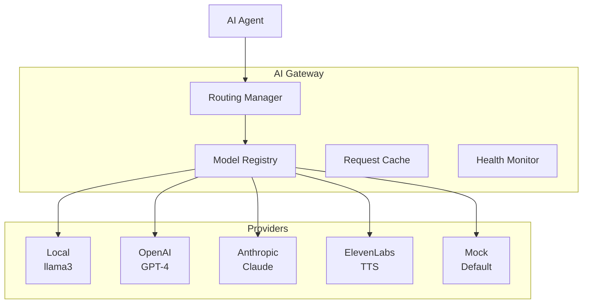

# AI Gateway Guide

The AI Gateway provides a unified, provider-agnostic interface for all AI operations in AMRAS.

## Architecture



## Components

### Model Registry (`modules/ai_gateway/registry/`)

The Model Registry manages provider and model registration:

```python
from modules.ai_gateway.registry.service import ModelRegistryService

registry = ModelRegistryService()

# Register a provider
await registry.register_provider(
    name="openai",
    type="cloud",
    api_key="sk-...",
    base_url="https://api.openai.com/v1"
)

# Register a model
await registry.register_model(
    provider="openai",
    name="gpt-4",
    capabilities=["text", "analysis"],
    pricing={"input": 0.03, "output": 0.06}
)

# Query available models
models = await registry.get_models(task="text_generation")
```

### Routing Manager (`modules/ai_gateway/routing/`)

The Routing Manager selects the best model for each request based on policies:

```python
from modules.ai_gateway.routing.manager import RoutingManager

router = RoutingManager()

# Route a request
model = await router.route(
    task_type="text_generation",
    quality="high",
    cost_limit=0.10,
    latency_limit=5000  # ms
)
```

### Routing Policies

Policies define how requests are routed to models:

| Policy | Description |
|---|---|
| `quality_first` | Prioritize model quality |
| `cost_first` | Minimize API costs |
| `latency_first` | Minimize response time |
| `balanced` | Balance quality, cost, and latency |
| `fallback` | Try primary model, fall back to alternatives |

### AI Provider Interface

All providers implement `AIProviderInterface`:

```python
from app.shared.providers.base import AIProviderInterface

class MyProvider(AIProviderInterface):
    async def generate_text(self, prompt: str, model: str, **kwargs) -> str:
        # Implementation
        ...

    async def generate_speech(self, text: str, voice: str, **kwargs) -> bytes:
        # Implementation
        ...

    async def health_check(self) -> bool:
        # Check provider availability
        ...
```

### AI Provider Manager

The `AIProviderManager` handles provider lifecycle:

```python
from app.shared.providers.base import AIProviderManager

manager = AIProviderManager()

# Register providers
manager.register_provider("local", MockAIProvider())
manager.register_provider("openai", OpenAIProvider(api_key="..."))

# Use a provider
result = await manager.generate_text(
    provider="openai",
    prompt="Summarize this chapter...",
    model="gpt-4"
)
```

## Default Provider

AMRAS ships with `MockAIProvider` as the default. This returns realistic mock data suitable for development and testing without API keys.

```python
# app/shared/providers/base.py
class MockAIProvider(AIProviderInterface):
    async def generate_text(self, prompt: str, model: str, **kwargs) -> str:
        return f"[Mock response for prompt: {prompt[:50]}...]"

    async def generate_speech(self, text: str, voice: str, **kwargs) -> bytes:
        return b"[Mock audio data]"
```

## Configuration

### Environment Variables

```env
# Provider selection
AI__PROVIDER=local          # Options: local, openai, anthropic, mock
AI__MODEL=llama3            # Default model name
AI__API_KEY=                # API key for cloud providers
AI__BASE_URL=               # Custom base URL
```

### Provider Configuration

Each provider can be configured via the database:

```python
# Register via API
POST /ai-gateway/providers
{
    "name": "openai",
    "type": "cloud",
    "api_key": "sk-...",
    "base_url": "https://api.openai.com/v1",
    "models": ["gpt-4", "gpt-3.5-turbo"]
}
```

## Supported Providers

### Text Generation (LLM)

| Provider | Models | Authentication |
|---|---|---|
| Local | llama3 | None (runs locally) |
| OpenAI | GPT-4, GPT-3.5-turbo | API key |
| Anthropic | Claude 3 | API key |
| Mock | N/A | None |

### Text-to-Speech (TTS)

| Provider | Voices | Authentication |
|---|---|---|
| Local | System TTS | None |
| ElevenLabs | Various | API key |
| Azure | Neural voices | Subscription key |
| Mock | N/A | None |

## Prompt Management

### Prompt Templates

Templates are versioned and stored in the database:

```python
# Create a template
POST /ai-gateway/prompts
{
    "name": "story_analysis",
    "template": "Analyze the following manga chapter and extract characters, events, and relationships:\n\n{chapter_text}",
    "version": "1.0"
}

# Use a template
GET /ai-gateway/prompts/story_analysis/latest
```

### Template Variables

Templates support variable substitution:

```python
template = "Summarize {chapter_count} chapters of {manga_title}"
rendered = template.format(chapter_count=5, manga_title="One Piece")
```

## Health Monitoring

The gateway monitors provider health:

```python
# Check provider health
GET /ai-gateway/health

# Response
{
    "providers": {
        "local": {"status": "healthy", "latency_ms": 150},
        "openai": {"status": "healthy", "latency_ms": 320},
        "mock": {"status": "healthy", "latency_ms": 1}
    }
}
```

## Caching

Responses are cached to reduce API calls:

- **Hash-based caching:** Request content is hashed
- **TTL support:** Entries expire after configurable time
- **Cache invalidation:** Manual or automatic

## Cost Tracking

The gateway tracks API usage costs:

```python
# Get usage statistics
GET /ai-gateway/usage?period=30d

# Response
{
    "total_requests": 1500,
    "total_tokens": 2500000,
    "total_cost": 45.50,
    "by_provider": {
        "openai": {"requests": 1200, "cost": 40.00},
        "local": {"requests": 300, "cost": 0.00}
    }
}
```

## Error Handling

The gateway handles provider failures gracefully:

```python
try:
    result = await manager.generate_text(provider="openai", prompt="...")
except ProviderUnavailableError:
    # Fall back to local model
    result = await manager.generate_text(provider="local", prompt="...")
except RateLimitError:
    # Wait and retry
    await asyncio.sleep(60)
    result = await manager.generate_text(provider="openai", prompt="...")
```

## Adding a New Provider

1. Implement `AIProviderInterface`:

```python
class MyProvider(AIProviderInterface):
    name = "my_provider"

    async def generate_text(self, prompt: str, model: str, **kwargs) -> str:
        ...

    async def generate_speech(self, text: str, voice: str, **kwargs) -> bytes:
        ...

    async def health_check(self) -> bool:
        ...
```

2. Register the provider:

```python
manager.register_provider("my_provider", MyProvider(api_key="..."))
```

3. Add configuration to `app/config/settings.py` if needed.

4. Add database models in `app/models/ai_gateway.py` if needed.
