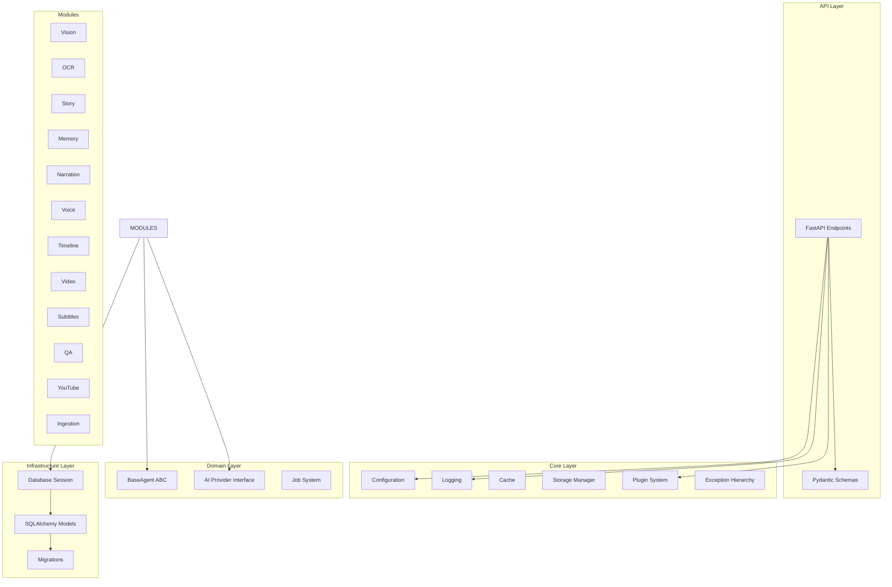
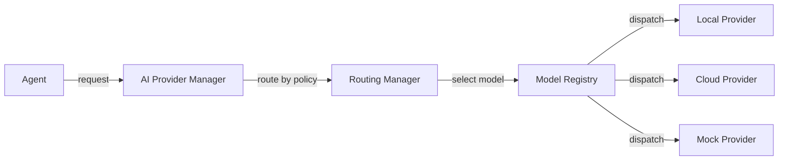
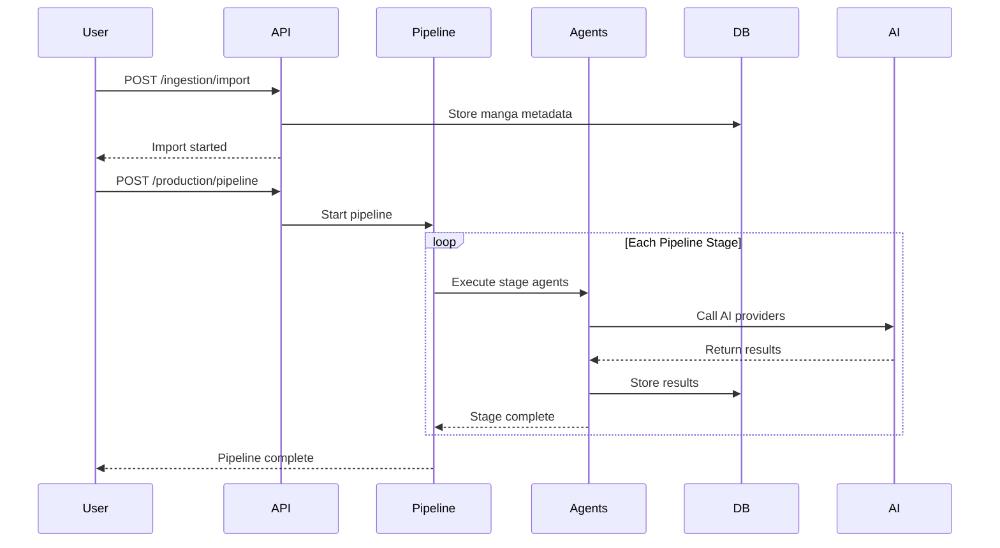

# Architecture Overview

AMRAS follows **Clean Architecture** principles with a plugin-based modular design. This document describes the system's layered architecture, module relationships, and key design patterns.

## Architectural Principles

| Principle | Implementation |
|---|---|
| **Single Responsibility** | Each agent handles one specific task |
| **Open/Closed** | Plugin system allows adding new agents without modifying core |
| **Interface Segregation** | `BaseAgent` ABC defines minimal interface |
| **Dependency Inversion** | Agents depend on abstractions, not implementations |
| **Separation of Concerns** | Clear layer boundaries between API, domain, and infrastructure |

## Layer Architecture



### 1. API Layer (`app/api/`)

The API layer exposes the system through FastAPI endpoints organized by domain.

- **Entry Point:** `app/api/main.py` -- App factory, router mounting, middleware
- **Endpoints:** `app/api/endpoints/` -- 13 domain-specific routers
- **Schemas:** `app/schemas/` -- Pydantic request/response models

Key characteristics:
- Async-first design
- Dependency injection for database sessions
- Structured error responses
- OpenAPI/Swagger documentation

### 2. Core Layer (`app/core/`)

The core layer provides foundational infrastructure used across all modules.

| Component | File | Responsibility |
|---|---|---|
| Configuration | `app/config/settings.py` | Pydantic Settings with nested `.env` support |
| Logging | `app/core/logger.py` | structlog with JSON/console rendering |
| Cache | `app/core/cache.py` | Pluggable cache with memory and disk backends |
| Storage | `app/core/storage.py` | Path-traversal-protected file storage |
| Plugins | `app/core/plugins.py` | Plugin system with category-based registration |
| Exceptions | `app/core/exceptions.py` | Hierarchical exception system with error codes |

### 3. Domain Layer (`app/agents/`, `app/jobs/`)

The domain layer defines the core abstractions that all modules implement.

- **BaseAgent ABC:** `app/agents/base.py` -- Interface for all AI agents
- **Job System:** `app/jobs/base.py` -- JobStatus, JobContext, BaseJob
- **AI Providers:** `app/shared/providers/base.py` -- Provider-agnostic AI interface

### 4. Infrastructure Layer (`app/database/`, `app/models/`, `alembic/`)

The infrastructure layer handles persistence and external system integration.

- **Database Session:** `app/database/session.py` -- Async SQLAlchemy engine and session maker
- **Models:** `app/models/` -- 100+ SQLAlchemy ORM models across 13 domains
- **Migrations:** `alembic/versions/` -- 8 migration versions

### 5. Modules (`modules/`)

Domain modules contain the business logic for each pipeline stage. Each module follows a consistent structure:

```
module/
  __init__.py
  agents.py          # Specialized AI agents (or agents/ subdirectory)
  engine.py          # Pipeline orchestration
  exceptions.py      # Module-specific errors
```

See [Project Structure](../README.md#project-structure) for the full module listing.

## Plugin System

### PluginInterface

All plugins conform to the `PluginInterface` ABC in `app/core/plugins.py`:

```python
class PluginInterface(ABC):
    name: str
    description: str
    version: str
    category: str

    async def initialize(self) -> None
    async def execute(self, context: dict) -> dict
    async def cleanup(self) -> None
```

### PluginManager

The `PluginManager` handles plugin discovery, registration, and lifecycle:

- Category-based registration (e.g., "ocr", "vision", "narration")
- Automatic discovery from configured plugin directories
- Lifecycle hooks (initialize, execute, cleanup)

## BaseAgent Pattern

All AI agents inherit from `BaseAgent` in `app/agents/base.py`:

```python
class BaseAgent(ABC):
    name: str
    description: str
    version: str

    @abstractmethod
    async def execute(self, context: JobContext) -> dict:
        """Execute the agent's primary task."""
        ...

    @abstractmethod
    async def validate(self, input_data: dict) -> bool:
        """Validate input data before execution."""
        ...

    @abstractmethod
    async def health_check(self) -> bool:
        """Check agent health and readiness."""
        ...

    @abstractmethod
    async def rollback(self, context: JobContext) -> bool:
        """Rollback changes on failure."""
        ...
```

### Agent Inventory

| Module | Agents | Purpose |
|---|---|---|
| Vision | Vision, Layout, CharacterDetection, SceneAnalysis | Image understanding |
| OCR | OCR, SoundEffect | Text extraction |
| Story | StoryAnalysis, CharacterAnalysis, EventExtraction, Relationship, Timeline, WorldAnalysis, QA | Story comprehension |
| Memory | MemoryManager | Knowledge storage and retrieval |
| Narration | ScriptPlanner, StoryNarrator, Humanization, Context, Consistency, Engagement, FactVerification, StyleEnforcement, QA | Script generation |
| Voice | VoiceGeneration, Emotion, AudioTiming, AudioStitching, AudioCleanup, QA, Pronunciation | Audio synthesis |
| Timeline | Planning, PanelSelection, CameraDirector, SceneComposition, AudioSync, ReadingFlow, MotionPlanning, QA | Timeline creation |
| Video | SceneRenderer, Animation, Composition, Encoding, Transitions, ResourceManagement, RenderManager, QA | Video rendering |
| Subtitles | SubtitleGeneration, Synchronization, Translation, Localization, Formatting, QA | Subtitle creation |
| QA | OCR, Story, Narration, Voice, Timeline, Video, Subtitle, Publishing, Performance, Security | Quality assurance |
| YouTube | SEO, Metadata, Publishing, Analytics, Playlist, QA | Publishing |
| Production | Asset, Model, QA, Queue, Recovery, Settings, Workflow | System management |

## AI Gateway

The AI Gateway provides provider-agnostic access to LLM and TTS services:



Components:
- **Model Registry** (`modules/ai_gateway/registry/`) -- Register and query providers/models
- **Routing Manager** (`modules/ai_gateway/routing/`) -- Policy-based model selection

## Database Architecture

- **ORM:** SQLAlchemy 2.0 with async support
- **Migrations:** Alembic with async engine (`async_engine_from_config`)
- **Development:** SQLite + aiosqlite
- **Production:** PostgreSQL + asyncpg

### Model Domains

| Domain | Models | Key Entities |
|---|---|---|
| Core | 6 | Project, Job, JobLog, AIProvider, Setting, SystemState |
| Manga | 5 | Manga, Chapter, Page, ImportJob, DownloadJob |
| Vision | 9 | VisionJob, Panel, SpeechBubble, CharacterDetected, ObjectDetected |
| Memory | 13 | MemoryStore, MemoryVersion, CharacterMemory, KnowledgeGraphNode/Edge |
| Story | 12 | StoryCharacter, StoryEvent, StoryRelationship, StoryTimeline |
| Voice | 7 | VoiceProfile, AudioJob, AudioSegment, PronunciationDictionary |
| Video | 7 | RenderJob, RenderScene, EncodedVideo, RenderReport |
| Timeline | 8 | Timeline, TimelineScene, CameraPath, Transition |
| Subtitles | 7 | SubtitleJob, SubtitleSegment, TranslationJob |
| YouTube | 12 | PublishingJob, Thumbnail, SEOProfile, VideoMetadata |
| QA | 8 | QAReport, QualityScore, IssueReport, AutoFixHistory |
| AI Gateway | 12 | AIGatewayProvider, AIModel, RoutingPolicy, PromptTemplate |
| Production | 9 | UserPreferences, ProjectHistory, SystemHealth |

## Data Flow



## Cross-Cutting Concerns

### Logging

All modules use structured logging via `structlog`:
- JSON format in production
- Console format in development
- Configurable log levels and rotation

### Error Handling

The exception hierarchy in `app/core/exceptions.py` provides:
- Typed exceptions for each failure mode
- Error codes for programmatic handling
- Retryability flags
- Recovery suggestions

### Caching

The pluggable cache system in `app/core/cache.py` supports:
- In-memory cache (fast, volatile)
- Disk cache (persistent, slower)
- Cache invalidation strategies

### Storage

The storage manager in `app/core/storage.py` provides:
- Path-traversal protection
- Lazy directory initialization
- Configurable storage locations per content type
