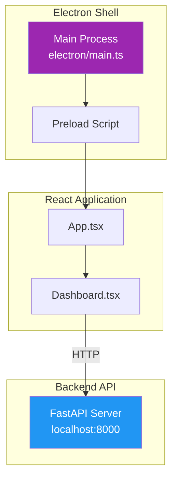

# Desktop Application Guide

This document covers the AMRAS desktop application.

## Overview

The AMRAS desktop application provides a GUI for monitoring and controlling the AMRAS system, built with Electron and React.

## Architecture



## Tech Stack

| Component | Technology |
|---|---|
| Desktop Shell | Electron 26 |
| UI Framework | React 18 |
| Language | TypeScript |
| Build Tool | Vite |
| HTTP Client | Axios / Fetch |

## Project Structure

```
desktop/
├── electron/
│   └── main.ts              # Electron main process
├── src/
│   ├── App.tsx              # React root component
│   └── components/
│       └── Dashboard.tsx    # Dashboard UI
├── package.json
└── vite.config.ts
```

## Main Process

The Electron main process creates the application window:

```typescript
// electron/main.ts
import { app, BrowserWindow } from 'electron';

function createWindow() {
    const win = new BrowserWindow({
        width: 1280,
        height: 800,
        webPreferences: {
            nodeIntegration: true,
            contextIsolation: true
        }
    });

    // In development, load from Vite dev server
    if (process.env.NODE_ENV === 'development') {
        win.loadURL('http://localhost:5173');
    } else {
        // In production, load built files
        win.loadFile('dist/index.html');
    }
}

app.whenReady().then(createWindow);
```

## Dashboard

The dashboard displays real-time system status:

```tsx
// src/components/Dashboard.tsx
import { useState, useEffect } from 'react';

export function Dashboard() {
    const [systemHealth, setSystemHealth] = useState(null);
    const [projects, setProjects] = useState([]);

    // Auto-refresh every 5 seconds
    useEffect(() => {
        const interval = setInterval(async () => {
            const health = await fetch('/production/system/resources');
            const data = await health.json();
            setSystemHealth(data);
        }, 5000);

        return () => clearInterval(interval);
    }, []);

    return (
        <div className="dashboard">
            <h1>AMRAS Dashboard</h1>
            <SystemHealth data={systemHealth} />
            <ProjectList projects={projects} />
            <JobMonitor />
        </div>
    );
}
```

## Features

### Real-Time Monitoring

- System health visualization (CPU, memory, disk, GPU)
- Active job tracking
- Pipeline progress indicators
- Error notifications

### Project Management

- View all manga projects
- Track project progress
- Start/stop pipelines
- View project history

### Job Monitoring

- Running jobs display
- Completed jobs history
- Failed jobs with error details
- Job retry functionality

## Development Setup

### Prerequisites

- Node.js 18+
- npm or yarn
- AMRAS backend running on port 8000

### Install Dependencies

```bash
cd desktop
npm install
```

### Start Development

```bash
# Start Vite dev server
npm run dev

# In another terminal, start Electron
npm run electron:dev
```

### Build for Production

```bash
# Build React app
npm run build

# Build Electron app
npm run electron:build

# Package for distribution
npx electron-builder
```

## Configuration

### Environment Variables

```env
# Backend API URL
VITE_API_URL=http://localhost:8000

# Electron settings
ELECTRON_DEV=false
```

### Vite Configuration

```typescript
// vite.config.ts
import { defineConfig } from 'vite';
import react from '@vitejs/plugin-react';

export default defineConfig({
    plugins: [react()],
    server: {
        port: 5173,
        proxy: {
            '/api': 'http://localhost:8000'
        }
    }
});
```

## Packaging

### Electron Builder

```json
{
    "build": {
        "appId": "com.amras.desktop",
        "productName": "AMRAS Desktop",
        "directories": {
            "output": "release"
        },
        "files": [
            "dist/**/*",
            "electron/**/*"
        ],
        "mac": {
            "target": "dmg"
        },
        "win": {
            "target": "nsis"
        },
        "linux": {
            "target": "AppImage"
        }
    }
}
```

## Troubleshooting

| Issue | Solution |
|---|---|
| App won't start | Check Node.js version (18+) |
| API not connecting | Ensure backend is running on port 8000 |
| Blank screen | Check dev server is running |
| Build fails | Run `npm install` again |
| Slow performance | Check system resources |
