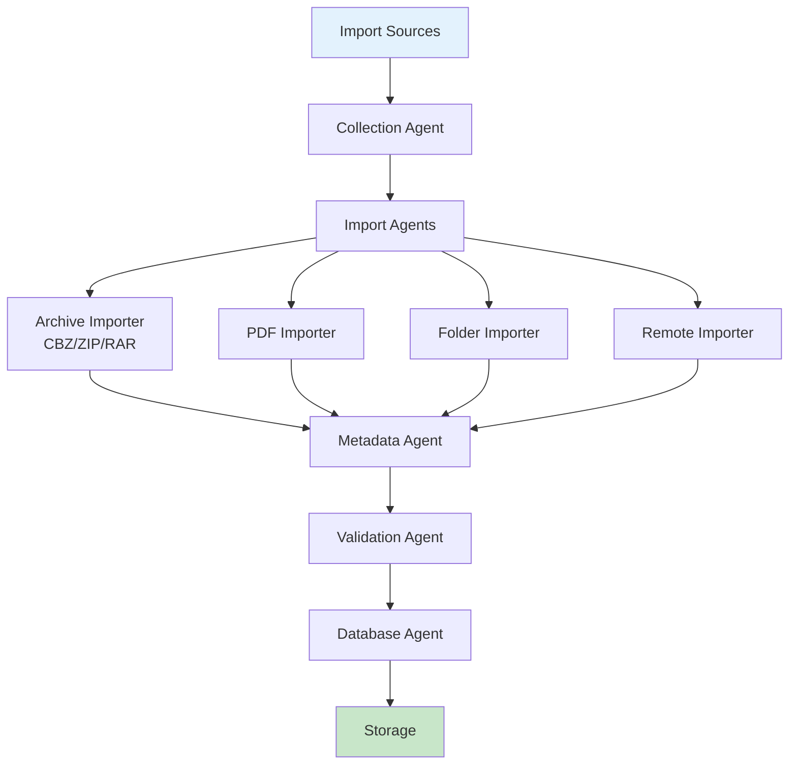

# Ingestion Guide

This document covers the Manga Ingestion pipeline in AMRAS.

## Overview

The Ingestion pipeline handles importing manga from various sources: CBZ/ZIP archives, PDFs, folder structures, and remote downloads.

## Architecture



## Modules

### Ingestion Module (`modules/ingestion/`)

| File | Purpose |
|---|---|
| `agents/collection_agent.py` | Orchestrate import agents |
| `agents/database_agent.py` | Persist manga metadata |
| `agents/file_system_agent.py` | File system operations |
| `agents/metadata_agent.py` | Extract metadata |
| `agents/validation_agent.py` | Validate import data |
| `importers/archive_importer.py` | CBZ/ZIP/RAR import |
| `importers/pdf_importer.py` | PDF import |
| `importers/folder_importer.py` | Folder structure import |
| `importers/remote_importer.py` | Remote download |
| `jobs/import_job.py` | Import job processor |
| `jobs/download_job.py` | Download job processor |

## Import Sources

### Archive Import (CBZ/ZIP/RAR)

```python
from modules.ingestion.importers.archive_importer import ArchiveImporter

importer = ArchiveImporter()
result = await importer.import_file({
    "file_path": "/path/to/manga.cbz",
    "manga_title": "Dragon Ball"
})

# Returns:
# {
#     "manga_id": 1,
#     "title": "Dragon Ball",
#     "chapters": [
#         {"number": 1, "pages": 20},
#         {"number": 2, "pages": 18}
#     ],
#     "total_pages": 38
# }
```

### PDF Import

```python
from modules.ingestion.importers.pdf_importer import PDFImporter

importer = PDFImporter()
result = await importer.import_file({
    "file_path": "/path/to/manga.pdf",
    "manga_title": "One Piece"
})
```

### Folder Import

```python
from modules.ingestion.importers.folder_importer import FolderImporter

importer = FolderImporter()
result = await importer.import_folder({
    "folder_path": "/path/to/manga/",
    "manga_title": "Naruto",
    "structure": "chapter/page"
})

# Expected folder structure:
# manga/
# ├── chapter_001/
# │   ├── page_001.png
# │   ├── page_002.png
# │   └── ...
# └── chapter_002/
#     └── ...
```

### Remote Import

```python
from modules.ingestion.importers.remote_importer import RemoteImporter

importer = RemoteImporter()
result = await importer.import_url({
    "url": "https://example.com/manga.cbz",
    "manga_title": "Attack on Titan"
})
```

## Pipeline Stages

### 1. Collection

The collection agent orchestrates the import:

```python
from modules.ingestion.agents.collection_agent import CollectionAgent

agent = CollectionAgent()
result = await agent.execute({
    "source_type": "archive",
    "source_path": "/path/to/manga.cbz",
    "manga_title": "Dragon Ball"
})
```

### 2. Metadata Extraction

Extract metadata from files:

```python
from modules.ingestion.agents.metadata_agent import MetadataAgent

agent = MetadataAgent()
result = await agent.execute({
    "file_path": "/path/to/manga.cbz",
    "extracted_files": [...]
})

# Returns:
# {
#     "title": "Dragon Ball",
#     "chapter_count": 10,
#     "page_count": 180,
#     "file_sizes": {...}
# }
```

### 3. Validation

Validate imported content:

```python
from modules.ingestion.agents.validation_agent import ValidationAgent

agent = ValidationAgent()
result = await agent.execute({
    "manga_data": {...},
    "validation_rules": {
        "min_pages_per_chapter": 10,
        "max_pages_per_chapter": 100,
        "required_image_formats": ["png", "jpg"]
    }
})

# Returns:
# {
#     "valid": true,
#     "warnings": [],
#     "errors": []
# }
```

### 4. Database Storage

Persist manga metadata:

```python
from modules.ingestion.agents.database_agent import DatabaseAgent

agent = DatabaseAgent()
result = await agent.execute({
    "manga_data": {...},
    "db_session": session
})

# Returns:
# {
#     "manga_id": 1,
#     "chapters_created": 10,
#     "pages_created": 180
# }
```

## Supported Formats

| Format | Extension | Notes |
|---|---|---|
| Comic Book Archive | `.cbz` | Most common format |
| ZIP Archive | `.zip` | Same as CBZ |
| RAR Archive | `.rar` | Requires unrar |
| PDF | `.pdf` | One page per image |
| Folder | Directory | Structured folders |

## Database Models

| Model | Purpose |
|---|---|
| `Manga` | Manga series metadata |
| `Chapter` | Chapter information |
| `Page` | Individual pages |
| `ImportJob` | Import job tracking |
| `DownloadJob` | Download tracking |

## API Endpoints

### Import Manga

```
POST /ingestion/import
```

**Request:** Multipart form data with manga files

### Download Manga

```
POST /ingestion/download
```

**Request:**
```json
{
    "url": "https://example.com/manga.cbz",
    "manga_id": "optional-existing-id"
}
```

### List Manga

```
GET /ingestion/manga
```

## Configuration

### Storage Paths

```env
STORAGE__MANGA_DIR=./storage/manga
STORAGE__EXTRACTED_DIR=./storage/extracted
```

## Best Practices

1. **Validate imports** before processing
2. **Use consistent naming** for manga/chapters
3. **Backup originals** before modification
4. **Monitor import jobs** for errors

## Troubleshooting

| Issue | Solution |
|---|---|
| CBZ won't open | Check file integrity |
| PDF extraction fails | Check pdf2image installation |
| Missing chapters | Verify folder structure |
| Slow import | Reduce batch size |
