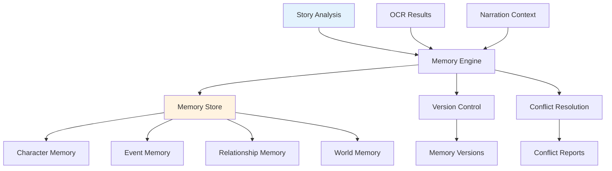
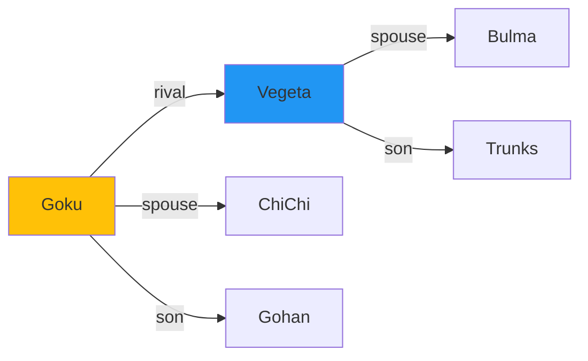

# Memory Engine Guide

This document covers the Memory Engine in AMRAS, which provides persistent, versioned story knowledge storage.

## Overview

The Memory Engine maintains a comprehensive knowledge base of story elements across manga chapters, enabling consistent and context-aware content generation.

## Architecture



## Modules

### Memory Module (`modules/memory/`)

| File | Purpose |
|---|---|
| `core.py` | MemoryManagerAgent with versioned storage |
| `engine.py` | Context package builder |
| `agents.py` | Memory-related agents |
| `validation.py` | Memory validation |

### Models (`app/models/memory.py`)

| Model | Purpose |
|---|---|
| `MemoryStore` | Main memory storage |
| `MemoryVersion` | Version history |
| `CharacterMemory` | Character knowledge |
| `RelationshipMemory` | Character relationships |
| `EventMemory` | Story events |
| `WorldMemory` | World knowledge |
| `ObjectMemory` | Object tracking |
| `AbilityMemory` | Character abilities |
| `Embedding` | Vector embeddings |
| `KnowledgeGraphNode` | Knowledge graph nodes |
| `KnowledgeGraphNodeEdge` | Knowledge graph edges |
| `MemoryAudit` | Change audit trail |
| `ConflictReport` | Memory conflicts |
| `RetrievalIndex` | Retrieval optimization |

## Core Operations

### Store Memory

```python
from modules.memory.core import MemoryManagerAgent

agent = MemoryManagerAgent()

# Store character memory
await agent.store({
    "type": "character",
    "key": "goku",
    "value": {
        "name": "Goku",
        "role": "protagonist",
        "abilities": ["ki_blast", "instant_transmission"],
        "relationships": ["vegeta_rival", "chichi_spouse"]
    },
    "metadata": {"chapter": 1, "source": "story_analysis"}
})
```

### Retrieve Memory

```python
# Retrieve by key
memory = await agent.retrieve({
    "type": "character",
    "key": "goku"
})

# Retrieve by type
characters = await agent.retrieve_by_type("character")

# Retrieve with filters
events = await agent.retrieve_by_type("event", filters={
    "chapter": {"$gte": 1, "$lte": 5},
    "importance": "major"
})
```

### Update Memory

```python
# Update with versioning
await agent.update({
    "type": "character",
    "key": "goku",
    "value": {
        "name": "Goku",
        "power_level": 9001,  # Updated
        "new_ability": "ultra_instinct"  # Added
    },
    "reason": "Power-up after training"
})
```

### Query Knowledge Graph

```python
# Query relationships
relationships = await agent.query_graph({
    "node": "goku",
    "relation": "rival",
    "depth": 2
})
```

## Version Control

Every memory change creates a new version:

```python
# Version history
versions = await agent.get_versions({
    "type": "character",
    "key": "goku"
})

# Returns:
# [
#     {"version": 1, "value": {...}, "created_at": "...", "reason": "Initial creation"},
#     {"version": 2, "value": {...}, "created_at": "...", "reason": "Power-up"},
# ]
```

### Rollback

```python
# Rollback to previous version
await agent.rollback({
    "type": "character",
    "key": "goku",
    "target_version": 1,
    "reason": "Incorrect data in version 2"
})
```

## Conflict Resolution

The engine detects and resolves memory conflicts:

```python
# Detect conflicts
conflicts = await agent.detect_conflicts({
    "type": "character",
    "key": "goku",
    "new_value": {...},
    "existing_value": {...}
})

# Returns:
# [
#     {
#         "conflict_type": "attribute_mismatch",
#         "field": "power_level",
#         "existing": 8000,
#         "proposed": 9001,
#         "resolution_options": ["overwrite", "merge", "manual"]
#     }
# ]
```

### Resolution Strategies

| Strategy | Description |
|---|---|
| `overwrite` | Replace existing with new value |
| `merge` | Combine existing and new values |
| `manual` | Flag for manual review |
| `newest` | Keep most recent update |
| `highest_confidence` | Keep highest confidence score |

## Context Package Builder

The `MemoryEngine` builds context packages for other modules:

```python
from modules.memory.engine import MemoryEngine

engine = MemoryEngine()

# Build context for narration
context = await engine.build_context({
    "chapter": 5,
    "scene_type": "battle",
    "required_entities": ["goku", "vegeta"],
    "max_tokens": 2000
})

# Returns:
# {
#     "characters": [...],
#     "recent_events": [...],
#     "relationships": [...],
#     "world_state": {...},
#     "continuity_notes": [...]
# }
```

## Knowledge Graph

The knowledge graph stores entity relationships:



### Graph Operations

```python
# Add node
await agent.add_graph_node({
    "label": "Goku",
    "type": "character",
    "properties": {"role": "protagonist"}
})

# Add edge
await agent.add_graph_edge({
    "source": "Goku",
    "target": "Vegeta",
    "relation": "rival",
    "weight": 0.8
})

# Shortest path
path = await agent.find_path({
    "source": "Goku",
    "target": "Bulma"
})
# Returns: ["Goku", "Vegeta", "Bulma"] or ["Goku", "ChiChi", "Bulma"]
```

## Vector Embeddings

For semantic search:

```python
# Store embedding
await agent.store_embedding({
    "entity_type": "character",
    "entity_id": "goku",
    "text": "A powerful Saiyan warrior known for his cheerful personality",
    "model": "default"
})

# Semantic search
results = await agent.semantic_search({
    "query": "powerful warrior",
    "entity_type": "character",
    "limit": 5
})
```

## Audit Trail

All changes are logged:

```python
# Get audit history
audit = await agent.get_audit({
    "type": "character",
    "key": "goku",
    "limit": 50
})

# Returns:
# [
#     {
#         "action": "update",
#         "old_value": {...},
#         "new_value": {...},
#         "timestamp": "...",
#         "reason": "Power-up"
#     }
# ]
```

## API Endpoints

### CRUD Operations

```
POST   /memory           # Create memory
GET    /memory/{id}      # Get memory
PUT    /memory/{id}      # Update memory
DELETE /memory/{id}      # Delete memory
GET    /memory           # List memories
```

### Graph Operations

```
POST   /memory/graph/node     # Add graph node
POST   /memory/graph/edge     # Add graph edge
GET    /memory/graph/path     # Find path
GET    /memory/graph/neighbors # Get neighbors
```

### Version Operations

```
GET    /memory/{id}/versions  # Get version history
POST   /memory/{id}/rollback  # Rollback to version
```

## Configuration

The memory engine uses the default AI provider and database configuration.

### Environment Variables

```env
# Database (recommended: PostgreSQL for production)
DB__URL=postgresql+asyncpg://...

# Storage
STORAGE__BASE_DIR=./storage
```

## Best Practices

1. **Always provide context** (chapter, source) for memories
2. **Use versioning** to track changes over time
3. **Run conflict resolution** for contradictory data
4. **Build context packages** before narration/voice generation
5. **Regularly audit** memory consistency

## Performance

- **Indexing:** Use `RetrievalIndex` for fast lookups
- **Batch operations:** Process multiple memories at once
- **Caching:** Frequently accessed memories are cached
- **Embeddings:** Use vector search for semantic queries

## Troubleshooting

| Issue | Solution |
|---|---|
| Memory conflicts | Run conflict resolution |
| Slow queries | Add retrieval indexes |
| Missing context | Verify memory storage |
| Version errors | Check version history |
