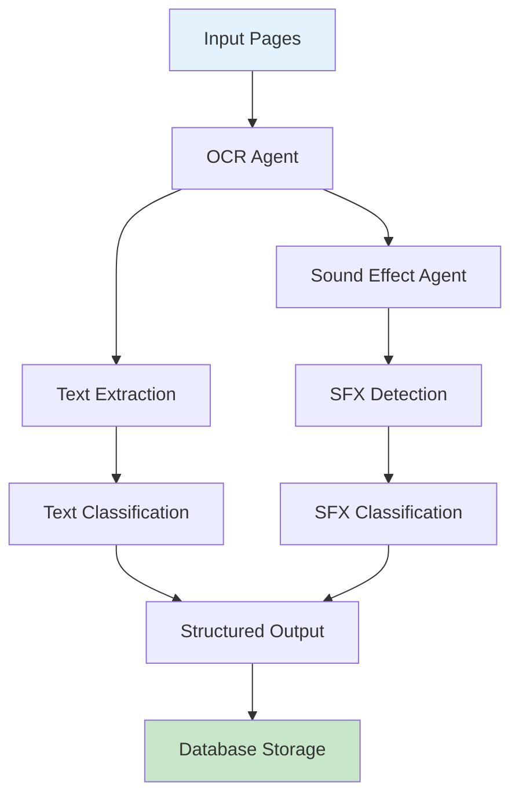

# OCR Guide

This document covers the OCR (Optical Character Recognition) pipeline in AMRAS.

## Overview

The OCR pipeline extracts text from manga pages, identifying speech bubbles, narration boxes, and sound effects.

## Architecture



## Modules

### OCR Module (`modules/ocr/`)

| File | Purpose |
|---|---|
| `agents/ocr_agent.py` | Main OCR agent and sound effect agent |
| `pipeline.py` | OCR pipeline orchestration |

### Models

OCR results are stored in the Vision models:

| Model | Purpose |
|---|---|
| `SpeechBubble` | Extracted speech bubble text |
| `Narration` | Narration text |
| `SoundEffect` | Detected sound effects |

## Pipeline Stages

### 1. Text Extraction

The OCR agent extracts text from manga pages:

```python
from modules.ocr.agents.ocr_agent import OCRAgent

agent = OCRAgent()
result = await agent.execute({
    "page_id": 123,
    "image_path": "/storage/manga/ch1/page_05.png",
    "language": "eng"
})

# Returns:
# {
#     "speech_bubbles": [
#         {"text": "Hello!", "bbox": [100, 200, 300, 350], "confidence": 0.95},
#         {"text": "Goodbye!", "bbox": [400, 100, 600, 250], "confidence": 0.92}
#     ],
#     "narration": [
#         {"text": "Meanwhile, at the castle...", "position": [50, 50, 200, 100]}
#     ]
# }
```

### 2. Sound Effect Detection

The sound effect agent identifies onomatopoeia:

```python
from modules.ocr.agents.ocr_agent import SoundEffectAgent

agent = SoundEffectAgent()
result = await agent.execute({
    "page_id": 123,
    "image_path": "/storage/manga/ch1/page_05.png"
})

# Returns:
# {
#     "sound_effects": [
#         {"text": "BOOM", "bbox": [150, 150, 250, 250], "intensity": "high"},
#         {"text": "whoosh", "bbox": [300, 300, 400, 350], "intensity": "medium"}
#     ]
# }
```

### 3. Text Classification

Extracted text is classified into categories:

| Category | Description |
|---|---|
| `speech` | Character dialogue |
| `narration` | Narrator text |
| `sfx` | Sound effects (onomatopoeia) |
| `thought` | Internal monologue |
| `caption` | Scene captions |

### 4. Database Storage

Results are persisted to the database:

```python
# Stored in models:
- SpeechBubble: Panel text with bounding boxes
- Narration: Narrator text
- SoundEffect: Sound effects with intensity
```

## OCR Engine

### Tesseract

The default OCR engine is Tesseract:

```env
OCR__ENGINE=tesseract
OCR__TESSERACT_PATH=tesseract
OCR__LANGUAGE=eng
```

### Supported Languages

| Language | Code |
|---|---|
| English | `eng` |
| Japanese | `jpn` |
| Korean | `kor` |
| Chinese (Simplified) | `chi_sim` |
| Chinese (Traditional) | `chi_tra` |

### Configuration

```python
# Multi-language support
result = await agent.execute({
    "page_id": 123,
    "image_path": "/path/to/page.png",
    "language": "eng+jpn"  # Multiple languages
})
```

## Preprocessing

Before OCR, images are preprocessed for better accuracy:

### Image Preprocessing (`modules/vision/preprocessing.py`)

| Step | Description |
|---|---|
| Deskew | Correct rotation |
| Denoise | Remove noise |
| Contrast | Enhance contrast |
| Threshold | Binarize image |
| Orientation | Correct orientation |
| Normalize | Standardize dimensions |

## Text Post-Processing

### Cleaning

```python
def clean_ocr_text(text: str) -> str:
    """Clean OCR output."""
    # Remove excessive whitespace
    text = re.sub(r'\s+', ' ', text)
    # Fix common OCR errors
    text = text.replace('|', 'I')
    text = text.replace('0', 'O')
    return text.strip()
```

### Deduplication

Near-duplicate text across panels is deduplicated:

```python
def deduplicate_text(texts: list[str], threshold: float = 0.9) -> list[str]:
    """Remove near-duplicate text entries."""
    unique = []
    for text in texts:
        if not any(similarity(text, existing) > threshold for existing in unique):
            unique.append(text)
    return unique
```

## Quality Metrics

Each extraction includes confidence scores:

| Metric | Range | Description |
|---|---|---|
| `confidence` | 0.0 - 1.0 | Text recognition confidence |
| `completeness` | 0.0 - 1.0 | How complete the text extraction is |
| `clarity` | 0.0 - 1.0 | Image quality affecting OCR |

## API Endpoints

### Extract Text

```
POST /ocr/extract
```

**Request:**
```json
{
    "page_ids": [1, 2, 3],
    "language": "eng",
    "preprocess": true
}
```

**Response:**
```json
{
    "job_id": "uuid",
    "status": "started",
    "page_count": 3
}
```

### Get Results

```
GET /ocr/results/{job_id}
```

**Response:**
```json
{
    "job_id": "uuid",
    "status": "completed",
    "results": [
        {
            "page_id": 1,
            "speech_bubbles": [...],
            "narration": [...],
            "sound_effects": [...]
        }
    ]
}
```

## Configuration

### Environment Variables

```env
OCR__ENGINE=tesseract
OCR__TESSERACT_PATH=tesseract
OCR__LANGUAGE=eng
```

### Tesseract Installation

```bash
# Ubuntu/Debian
sudo apt-get install tesseract-ocr tesseract-ocr-eng

# macOS
brew install tesseract

# Windows
# Download from https://github.com/tesseract-ocr/tesseract
```

## Best Practices

1. **Preprocess images** for better accuracy
2. **Specify languages** correctly
3. **Review low-confidence results** manually
4. **Use batch processing** for multiple pages
5. **Store OCR results** in database for caching

## Troubleshooting

| Issue | Solution |
|---|---|
| Low accuracy | Improve image preprocessing |
| Wrong language | Set correct `OCR__LANGUAGE` |
| Tesseract not found | Install Tesseract, set `OCR__TESSERACT_PATH` |
| Slow processing | Use batch mode, check image size |
| Missing text | Try different preprocessing steps |
