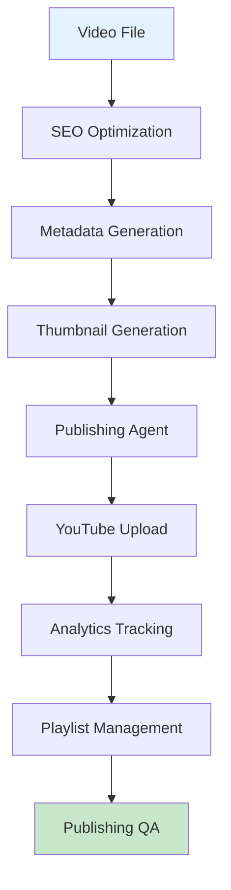

# Publishing Guide

This document covers the YouTube Publishing pipeline in AMRAS.

## Overview

The Publishing module handles YouTube upload, SEO optimization, metadata generation, analytics tracking, and playlist management.

## Architecture



## Modules

### YouTube Module (`modules/youtube/`)

| File | Purpose |
|---|---|
| `seo_agent.py` | SEO optimization |
| `metadata_agent.py` | Metadata generation |
| `publishing_agent.py` | Video publishing |
| `analytics_agent.py` | Analytics tracking |
| `playlist_agent.py` | Playlist management |
| `qa_agent.py` | Publishing QA |

### Models (`app/models/youtube.py`)

| Model | Purpose |
|---|---|
| `PublishingJob` | Publishing tracking |
| `Thumbnail` | Video thumbnails |
| `ThumbnailVariant` | Thumbnail variants |
| `SEOProfile` | SEO optimization |
| `Title` | Optimized titles |
| `Description` | Optimized descriptions |
| `Tag` | Video tags |
| `Playlist` | YouTube playlists |
| `Schedule` | Publishing schedule |
| `VideoMetadata` | Video metadata |
| `PublishedVideo` | Published videos |
| `AnalyticsProfile` | Analytics tracking |

## Pipeline Stages

### 1. SEO Optimization

Optimize video metadata for search:

```python
from modules.youtube.seo_agent import SEOAgent

agent = SEOAgent()
result = await agent.execute({
    "title": "Manga Recap: Dragon Ball Chapters 1-5",
    "description": "An epic recap of the first 5 chapters...",
    "tags": ["manga", "recap", "dragon ball"],
    "target_audience": "anime fans"
})

# Returns:
# {
#     "optimized_title": "Dragon Ball Recap | Chapters 1-5 | Epic Anime Summary",
#     "optimized_description": "...",
#     "optimized_tags": ["dragon ball", "manga recap", "anime summary", ...],
#     "seo_score": 0.87
# }
```

### 2. Metadata Generation

Generate complete video metadata:

```python
from modules.youtube.metadata_agent import MetadataAgent

agent = MetadataAgent()
result = await agent.execute({
    "manga_title": "Dragon Ball",
    "chapters": [1, 2, 3, 4, 5],
    "video_duration": 600,
    "content_summary": "..."
})

# Returns:
# {
#     "title": "...",
#     "description": "...",
#     "tags": [...],
#     "category": "Entertainment",
#     "language": "en"
# }
```

### 3. Thumbnail Generation

Create engaging thumbnails:

```python
from modules.thumbnails.planning_agent import ThumbnailPlanningAgent
from modules.thumbnails.composition_agent import ThumbnailCompositionAgent

# Plan thumbnail
planner = ThumbnailPlanningAgent()
plan = await planner.execute({
    "manga_title": "Dragon Ball",
    "key_scene": "Goku's first Kamehameha",
    "style": "dramatic"
})

# Compose thumbnail
composer = ThumbnailCompositionAgent()
result = await composer.execute({
    "plan": plan,
    "source_panels": [...]
})

# Returns:
# {
#     "thumbnail_path": "/storage/thumbnails/thumb_default.png",
#     "variants": [
#         {"path": "/storage/thumbnails/thumb_a.png", "style": "dramatic"},
#         {"path": "/storage/thumbnails/thumb_b.png", "style": "clean"}
#     ]
# }
```

### 4. Publishing

Upload video to YouTube:

```python
from modules.youtube.publishing_agent import PublishingAgent

agent = PublishingAgent()
result = await agent.execute({
    "video_path": "/storage/videos/final.mp4",
    "title": "Dragon Ball Recap | Chapters 1-5",
    "description": "...",
    "tags": [...],
    "thumbnail_path": "/storage/thumbnails/thumb_default.png",
    "category": "24",  # Entertainment
    "privacy": "public"
})

# Returns:
# {
#     "youtube_video_id": "dQw4w9WgXcQ",
#     "youtube_url": "https://youtu.be/dQw4w9WgXcQ",
#     "status": "uploaded"
# }
```

### 5. Analytics Tracking

Track video performance:

```python
from modules.youtube.analytics_agent import AnalyticsAgent

agent = AnalyticsAgent()
result = await agent.execute({
    "video_id": "uuid",
    "youtube_video_id": "dQw4w9WgXcQ"
})

# Returns:
# {
#     "views": 1500,
#     "likes": 120,
#     "comments": 45,
#     "watch_time_minutes": 4500,
#     "subscriber_growth": 25
# }
```

### 6. Playlist Management

Organize videos into playlists:

```python
from modules.youtube.playlist_agent import PlaylistAgent

agent = PlaylistAgent()
result = await agent.execute({
    "action": "add_to_playlist",
    "video_id": "uuid",
    "playlist_id": "PLxxxxxx",
    "position": 5
})

# Returns:
# {
#     "success": true,
#     "playlist_position": 5
# }
```

### 7. Publishing QA

Validate before and after publishing:

```python
from modules.youtube.qa_agent import PublishingQAAgent

agent = PublishingQAAgent()
result = await agent.execute({
    "video_path": "/storage/videos/final.mp4",
    "metadata": {...},
    "thumbnail_path": "/storage/thumbnails/thumb_default.png"
})

# Returns:
# {
#     "quality_score": 0.92,
#     "issues": [],
#     "checks": {
#         "video_format": "passed",
#         "metadata_complete": "passed",
#         "thumbnail_valid": "passed",
#         "seo_optimized": "passed"
#     }
# }
```

## API Endpoints

### Publish Video

```
POST /youtube/publish
```

**Request:**
```json
{
    "video_id": "uuid",
    "title": "Manga Recap: Chapter 1-5",
    "description": "An epic recap of...",
    "tags": ["manga", "recap", "anime"],
    "playlist_id": "optional-playlist-id",
    "schedule_time": "2024-01-15T18:00:00Z"
}
```

### Get Publishing Status

```
GET /youtube/publishing/{job_id}
```

### Get Analytics

```
GET /youtube/analytics/{video_id}
```

### Manage Playlists

```
POST /youtube/playlists
GET  /youtube/playlists
POST /youtube/playlists/{playlist_id}/videos
```

### Generate Thumbnail

```
POST /thumbnail/generate
```

## SEO Best Practices

### Title Optimization

- Include main keyword in first 60 characters
- Use numbers and brackets for clarity
- Create curiosity or urgency

**Examples:**
- `Dragon Ball Recap | Chapters 1-5 | Epic Anime Summary`
- `One Piece Chapters 1000-1010 | INSANE BATTLES Explained`

### Description Optimization

- First 150 characters are crucial
- Include timestamps
- Add relevant links
- Use keywords naturally

### Tag Strategy

- Primary keyword: `dragon ball recap`
- Secondary: `manga recap`, `anime summary`
- Long-tail: `dragon ball chapters 1-5 explained`

## Scheduling

```python
# Schedule publication
POST /youtube/schedule
{
    "video_id": "uuid",
    "scheduled_time": "2024-01-15T18:00:00Z",
    "timezone": "America/New_York"
}
```

## Configuration

### YouTube API

```env
YOUTUBE__API_KEY=your-api-key
YOUTUBE__CLIENT_ID=your-client-id
YOUTUBE__CLIENT_SECRET=your-client-secret
```

### Thumbnail Settings

```env
STORAGE__THUMBNAILS_DIR=./storage/thumbnails
```

## Best Practices

1. **Optimize SEO** before publishing
2. **Use custom thumbnails** for better CTR
3. **Schedule publications** for optimal timing
4. **Monitor analytics** for performance
5. **Organize playlists** for discoverability

## Troubleshooting

| Issue | Solution |
|---|---|
| Upload fails | Check API key and quota |
| Low views | Improve SEO and thumbnail |
| Copyright strike | Verify content rights |
| Schedule not working | Check timezone settings |
| Analytics missing | Wait 24-48 hours for data |
