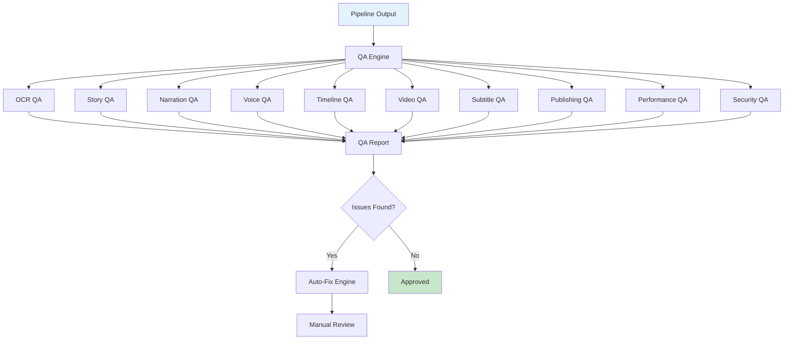

# QA Guide

This document covers the Quality Assurance system in AMRAS.

## Overview

The QA Engine runs 10 parallel quality assurance agents to validate every aspect of the content pipeline.

## Architecture



## Modules

### QA Module (`modules/qa/`)

| File | Purpose |
|---|---|
| `agents.py` | 10 QA agents |
| `engine.py` | Parallel QA execution |
| `autofix.py` | Auto-fix engine |

### Agents

| Agent | Validates |
|---|---|
| `OCRAgent` | OCR text quality |
| `StoryAgent` | Story analysis accuracy |
| `NarrationAgent` | Narration script quality |
| `VoiceAgent` | Audio quality |
| `TimelineAgent` | Timeline accuracy |
| `VideoAgent` | Video rendering quality |
| `SubtitleAgent` | Subtitle accuracy |
| `PublishingAgent` | Publishing readiness |
| `PerformanceAgent` | System performance |
| `SecurityAgent` | Security checks |

## QA Execution

The QA Engine runs all agents in parallel:

```python
from modules.qa.engine import QAEngine

engine = QAEngine()

report = await engine.run(
    project_id=1,
    checks=["ocr", "story", "narration", "voice", "timeline", "video"],
    db_session=session
)

# Returns:
# {
#     "report_id": "uuid",
#     "overall_score": 0.91,
#     "status": "passed",
#     "agent_scores": {
#         "ocr": 0.95,
#         "story": 0.92,
#         "narration": 0.89,
#         "voice": 0.93,
#         "timeline": 0.88,
#         "video": 0.90
#     },
#     "issues": [],
#     "recommendations": [...]
# }
```

## Individual QA Checks

### OCR QA

```python
from modules.qa.agents import OCRAgent

agent = OCRAgent()
result = await agent.execute({
    "ocr_results": [...],
    "source_pages": [...]
})

# Checks:
# - Text extraction confidence
# - Completeness of extraction
# - Accuracy of speech bubble detection
# - Sound effect detection
```

### Story QA

```python
from modules.qa.agents import StoryAgent

agent = StoryAgent()
result = await agent.execute({
    "story_analysis": {...},
    "source_content": [...]
})

# Checks:
# - Character consistency
# - Event accuracy
# - Timeline coherence
# - Relationship mapping completeness
```

### Narration QA

```python
from modules.qa.agents import NarrationAgent

agent = NarrationAgent()
result = await agent.execute({
    "narration_script": "...",
    "story_analysis": {...}
})

# Checks:
# - Script completeness
# - Factual accuracy
# - Style consistency
# - Engagement level
# - Grammar and spelling
```

### Voice QA

```python
from modules.qa.agents import VoiceAgent

agent = VoiceAgent()
result = await agent.execute({
    "audio_path": "/storage/audio/narration.wav",
    "script": "Original text..."
})

# Checks:
# - Audio clarity
# - Emotion accuracy
# - Pacing
# - Pronunciation
# - Audio artifacts
```

### Timeline QA

```python
from modules.qa.agents import TimelineAgent

agent = TimelineAgent()
result = await agent.execute({
    "timeline": {...},
    "audio_track": "/storage/audio/narration.wav"
})

# Checks:
# - Audio-visual sync
# - Scene duration appropriateness
# - Panel selection quality
# - Camera movement smoothness
# - Transition effectiveness
```

### Video QA

```python
from modules.qa.agents import VideoAgent

agent = VideoAgent()
result = await agent.execute({
    "video_path": "/storage/videos/final.mp4",
    "expected_duration": 180.0
})

# Checks:
# - Resolution matches specification
# - Frame rate consistency
# - Audio-video synchronization
# - Visual quality
# - File size reasonableness
```

### Subtitle QA

```python
from modules.qa.agents import SubtitleAgent

agent = SubtitleAgent()
result = await agent.execute({
    "subtitle_path": "/storage/subtitles/narration.srt",
    "audio_track": "/storage/audio/narration.wav"
})

# Checks:
# - Timing accuracy
# - Text readability
# - Format validity
# - Language accuracy
# - Completeness
```

### Publishing QA

```python
from modules.qa.agents import PublishingAgent

agent = PublishingAgent()
result = await agent.execute({
    "video_path": "/storage/videos/final.mp4",
    "metadata": {...},
    "thumbnail_path": "/storage/thumbnails/thumb.png"
})

# Checks:
# - Video format compatibility
# - Metadata completeness
# - SEO optimization
# - Thumbnail validity
# - File size limits
```

### Performance QA

```python
from modules.qa.agents import PerformanceAgent

agent = PerformanceAgent()
result = await agent.execute({
    "pipeline_metrics": {...}
})

# Checks:
# - Processing time
# - Resource utilization
# - Memory usage
# - CPU/GPU usage
# - Storage efficiency
```

### Security QA

```python
from modules.qa.agents import SecurityAgent

agent = SecurityAgent()
result = await agent.execute({
    "pipeline_data": {...}
})

# Checks:
# - No exposed secrets
# - Proper file permissions
# - Input validation
# - Path traversal protection
```

## Auto-Fix Engine

The Auto-Fix engine attempts to fix common issues:

```python
from modules.qa.autofix import AutoFixEngine

engine = AutoFixEngine()

fixes = await engine.attempt_fixes(
    issues=[...],
    context={...}
)

# Returns:
# {
#     "fixed": [
#         {"issue_id": "1", "fix": "Regenerated subtitle timing", "success": true}
#     ],
#     "requires_manual": [
#         {"issue_id": "2", "reason": "Audio quality too low for auto-fix"}
#     ]
# }
```

## Database Models

| Model | Purpose |
|---|---|
| `QAReport` | QA reports |
| `QualityScore` | Quality metrics |
| `IssueReport` | Issues found |
| `AutoFixHistory` | Auto-fix attempts |
| `ManualReview` | Manual review items |
| `PerformanceReport` | Performance metrics |
| `ApprovalHistory` | Approval tracking |
| `ValidationMetric` | Validation results |

## API Endpoints

### Run QA

```
POST /qa/run
```

**Request:**
```json
{
    "project_id": 1,
    "checks": ["ocr", "story", "narration", "voice", "timeline", "video"]
}
```

### Get QA Report

```
GET /qa/reports/{report_id}
```

### List QA Reports

```
GET /qa/reports?project_id=1
```

### Get Issues

```
GET /qa/issues?report_id=uuid
```

### Request Manual Review

```
POST /qa/review/{issue_id}
```

## Quality Thresholds

| Category | Minimum Score | Description |
|---|---|---|
| Overall | 0.85 | Minimum for approval |
| OCR | 0.90 | Text extraction quality |
| Story | 0.85 | Story analysis accuracy |
| Narration | 0.85 | Script quality |
| Voice | 0.90 | Audio quality |
| Timeline | 0.85 | Timeline accuracy |
| Video | 0.90 | Video rendering quality |
| Subtitle | 0.90 | Subtitle accuracy |

## Manual Review Workflow

Issues that can't be auto-fixed are flagged for manual review:

```python
# Request manual review
POST /qa/review/{issue_id}
{
    "reviewer": "user@example.com",
    "notes": "Reviewed and approved"
}
```

## Configuration

QA agents use the default AI provider configuration.

## Best Practices

1. **Run QA at each pipeline stage** for early issue detection
2. **Review QA reports** before publishing
3. **Use auto-fix** for common issues
4. **Track QA metrics** over time
5. **Set appropriate thresholds** for your use case

## Troubleshooting

| Issue | Solution |
|---|---|
| Low overall score | Check individual agent scores |
| Auto-fix failing | Review issue details |
| QA timeout | Reduce batch size |
| False positives | Adjust thresholds |
