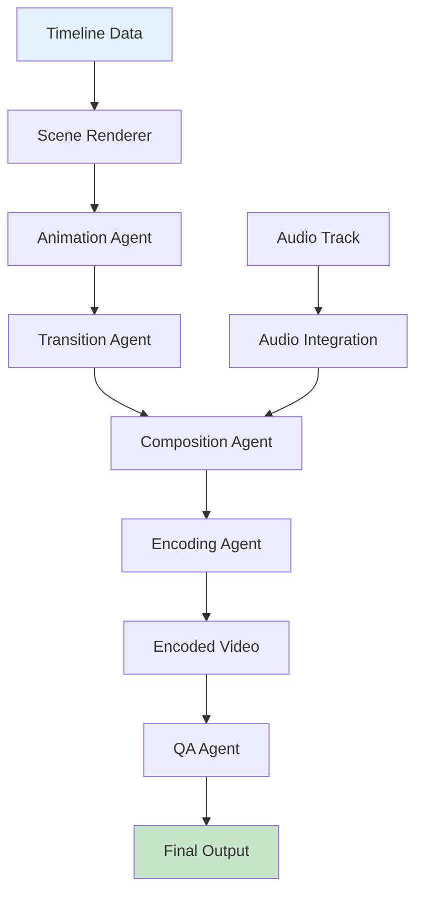

# Rendering Guide

This document covers the video rendering pipeline in AMRAS.

## Overview

The video rendering pipeline transforms manga pages, audio tracks, and timeline data into polished YouTube-ready videos.

## Architecture



## Modules

### Video Module (`modules/video/`)

| File | Purpose |
|---|---|
| `agents/scene_renderer.py` | Renders individual scenes from panel data |
| `agents/animation_agent.py` | Applies animations (Ken Burns, pan, zoom) |
| `agents/transition_agent.py` | Creates transitions between scenes |
| `agents/composition_agent.py` | Composes final video from scenes |
| `agents/encoding_agent.py` | Encodes video with FFmpeg |
| `agents/resource_manager.py` | Manages GPU/CPU resources |
| `agents/render_manager.py` | Orchestrates the render pipeline |
| `agents/qa_agent.py` | Quality assurance checks |

### Models (`app/models/video.py`)

| Model | Purpose |
|---|---|
| `EncodingProfile` | Encoding settings (codec, resolution, FPS) |
| `RenderJob` | Render job tracking |
| `RenderScene` | Per-scene render data |
| `EncodedVideo` | Output video metadata |
| `RenderReport` | Quality metrics |
| `OutputFile` | Output file tracking |
| `RenderStatistic` | Performance statistics |

## Pipeline Stages

### 1. Scene Rendering

Each scene is rendered from manga panels with applied animations:

```python
from modules.video.agents.scene_renderer import SceneRendererAgent

agent = SceneRendererAgent()
scene_data = await agent.execute({
    "panel_id": 123,
    "image_path": "/storage/extracted/ch1/page_05.png",
    "animation": {
        "type": "ken_burns",
        "start_zoom": 1.0,
        "end_zoom": 1.3,
        "direction": "right"
    },
    "duration": 5.0,
    "resolution": "1920x1080"
})
```

### 2. Animation

Animations bring static panels to life:

| Animation | Description |
|---|---|
| `ken_burns` | Slow zoom and pan effect |
| `pan_left` | Horizontal pan left |
| `pan_right` | Horizontal pan right |
| `zoom_in` | Gradual zoom in |
| `zoom_out` | Gradual zoom out |
| `static` | No animation |

### 3. Transitions

Transitions connect scenes smoothly:

| Transition | Description |
|---|---|
| `fade` | Cross-fade between scenes |
| `dissolve` | Dissolve effect |
| `wipe_left` | Horizontal wipe left |
| `wipe_right` | Horizontal wipe right |
| `cut` | Hard cut (instant) |

### 4. Composition

The composition agent assembles all elements:

```python
from modules.video.agents.composition_agent import CompositionAgent

agent = CompositionAgent()
composition = await agent.execute({
    "scenes": [...],  # Rendered scene paths
    "audio_track": "/storage/audio/narration.wav",
    "subtitles": "/storage/subtitles/narration.srt",
    "transitions": [...],
    "config": {
        "resolution": "1920x1080",
        "fps": 30,
        "codec": "h264"
    }
})
```

### 5. Encoding

FFmpeg handles the final encoding:

```python
from modules.video.agents.encoding_agent import EncodingAgent

agent = EncodingAgent()
result = await agent.execute({
    "input_path": "/tmp/composition.mp4",
    "output_path": "/storage/videos/final.mp4",
    "profile": {
        "codec": "libx264",
        "resolution": "1920x1080",
        "fps": 30,
        "bitrate": "8M",
        "audio_codec": "aac",
        "audio_bitrate": "192k"
    }
})
```

## Resource Management

The resource manager monitors and allocates system resources:

```python
from modules.video.agents.resource_manager import ResourceManagerAgent

agent = ResourceManagerAgent()
resources = await agent.execute({})

# Returns:
# {
#     "cpu_percent": 45.2,
#     "memory_percent": 62.1,
#     "gpu_available": true,
#     "gpu_memory_free": "8GB",
#     "disk_free": "150GB"
# }
```

## Configuration

### Environment Variables

```env
VIDEO__RESOLUTION=1920x1080
VIDEO__FPS=30
VIDEO__FFMPEG_PATH=ffmpeg
VIDEO__FFPROBE_PATH=ffprobe
```

### Encoding Profiles

```json
{
    "youtube_1080p": {
        "codec": "libx264",
        "resolution": "1920x1080",
        "fps": 30,
        "bitrate": "8M",
        "audio_codec": "aac",
        "audio_bitrate": "192k",
        "preset": "medium",
        "crf": 23
    },
    "youtube_4k": {
        "codec": "libx264",
        "resolution": "3840x2160",
        "fps": 30,
        "bitrate": "30M",
        "audio_codec": "aac",
        "audio_bitrate": "320k",
        "preset": "slow",
        "crf": 20
    }
}
```

## Quality Assurance

The QA agent validates rendered video:

- Resolution matches specification
- Frame rate is consistent
- Audio-video synchronization
- No visual artifacts
- File size is reasonable
- Duration matches timeline

## Performance Tips

1. **Use GPU acceleration** when available (`GPU__ENABLED=true`)
2. **Lower CRF** for better quality (larger files)
3. **Use `preset=fast`** for development, `preset=slow` for production
4. **Batch render scenes** to parallelize work
5. **Monitor resource usage** to avoid OOM

## FFmpeg Requirements

```bash
# Check FFmpeg installation
ffmpeg -version
ffprobe -version

# Required codecs
ffmpeg -codecs | grep libx264
ffmpeg -codecs | grep aac
```

## Troubleshooting

| Issue | Solution |
|---|---|
| FFmpeg not found | Install FFmpeg, set `VIDEO__FFMPEG_PATH` |
| Out of memory | Reduce batch size, increase GPU memory |
| Audio sync issues | Check timeline synchronization data |
| Poor quality | Lower CRF value, increase bitrate |
| Slow encoding | Use GPU acceleration, faster preset |
