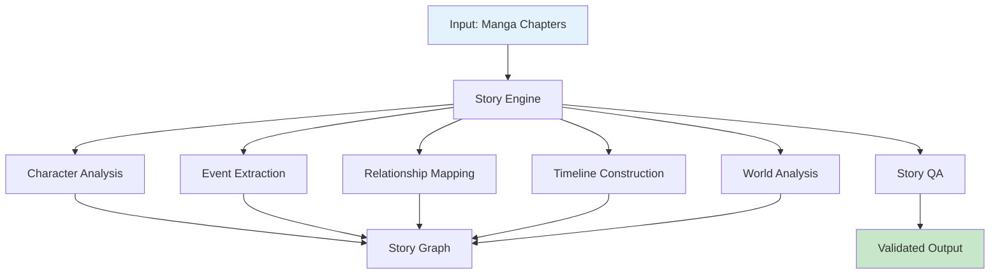
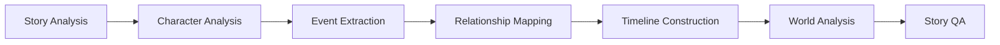

# Story Engine Guide

This document covers the AI-powered story analysis engine in AMRAS.

## Overview

The Story Engine uses multiple AI agents to understand manga narratives, extracting characters, events, relationships, and timeline information.

## Architecture



## Modules

### Story Module (`modules/story/`)

| File | Purpose |
|---|---|
| `agents.py` | 7 story analysis agents |
| `engine.py` | Multi-agent orchestration |
| `exceptions.py` | Story-specific errors |

### Agents

| Agent | Purpose |
|---|---|
| `StoryAnalysisAgent` | High-level story understanding |
| `CharacterAnalysisAgent` | Character extraction and profiling |
| `EventExtractionAgent` | Event identification and sequencing |
| `RelationshipAgent` | Character relationship mapping |
| `TimelineAgent` | Narrative timeline construction |
| `WorldAnalysisAgent` | Setting and world knowledge |
| `StoryQAAgent` | Story analysis quality assurance |

## Pipeline Stages

### 1. Story Analysis

High-level understanding of the narrative:

```python
from modules.story.agents import StoryAnalysisAgent

agent = StoryAnalysisAgent()
result = await agent.execute({
    "chapter_id": 1,
    "pages": [...],
    "ocr_text": [...]
})

# Returns:
# {
#     "summary": "A hero embarks on a journey...",
#     "genre": "action",
#     "mood": "dramatic",
#     "themes": ["friendship", "courage"],
#     "key_moments": [...]
# }
```

### 2. Character Analysis

Extract and profile characters:

```python
from modules.story.agents import CharacterAnalysisAgent

agent = CharacterAnalysisAgent()
result = await agent.execute({
    "chapter_id": 1,
    "panels": [...],
    "ocr_text": [...]
})

# Returns:
# {
#     "characters": [
#         {
#             "name": "Goku",
#             "role": "protagonist",
#             "description": "A powerful warrior...",
#             "personality": ["brave", "loyal"],
#             "first_appearance": 1,
#             "relationships": [...]
#         }
#     ]
# }
```

### 3. Event Extraction

Identify and sequence events:

```python
from modules.story.agents import EventExtractionAgent

agent = EventExtractionAgent()
result = await agent.execute({
    "chapter_id": 1,
    "pages": [...],
    "ocr_text": [...]
})

# Returns:
# {
#     "events": [
#         {
#             "id": "evt_001",
#             "description": "Goku arrives at the tournament",
#             "chapter": 1,
#             "page": 3,
#             "importance": "major",
#             "characters": ["Goku"],
#             "location": "Tournament Arena"
#         }
#     ]
# }
```

### 4. Relationship Mapping

Map character relationships:

```python
from modules.story.agents import RelationshipAgent

agent = RelationshipAgent()
result = await agent.execute({
    "characters": [...],
    "interactions": [...]
})

# Returns:
# {
#     "relationships": [
#         {
#             "source": "Goku",
#             "target": "Vegeta",
#             "type": "rival",
#             "strength": 0.8,
#             "description": "Fierce rivals who push each other to improve"
#         }
#     ]
# }
```

### 5. Timeline Construction

Build narrative timeline:

```python
from modules.story.agents import TimelineAgent

agent = TimelineAgent()
result = await agent.execute({
    "events": [...],
    "chapters": [1, 2, 3]
})

# Returns:
# {
#     "timeline": [
#         {
#             "event_id": "evt_001",
#             "narrative_time": "Beginning",
#             "chapter": 1,
#             "page": 3,
#             "order": 1
#         }
#     ]
# }
```

### 6. World Analysis

Understand settings and world-building:

```python
from modules.story.agents import WorldAnalysisAgent

agent = WorldAnalysisAgent()
result = await agent.execute({
    "chapters": [...],
    "locations": [...]
})

# Returns:
# {
#     "locations": [
#         {
#             "name": "Tournament Arena",
#             "description": "A large colosseum...",
#             "significance": "Setting for major battles"
#         }
#     ],
#     "organizations": [...],
#     "rules": [...]
# }
```

### 7. Story QA

Validate story analysis:

```python
from modules.story.agents import StoryQAAgent

agent = StoryQAAgent()
result = await agent.execute({
    "analysis": {...}
})

# Returns:
# {
#     "quality_score": 0.92,
#     "issues": [],
#     "suggestions": ["Consider adding more detail to character X"]
# }
```

## Engine Orchestration

The `StoryEngine` orchestrates all agents:

```python
from modules.story.engine import StoryEngine

engine = StoryEngine()

# Run full analysis
result = await engine.run(
    manga_id=1,
    chapters=[1, 2, 3],
    db_session=session
)

# Result contains:
# - story_analysis
# - characters
# - events
# - relationships
# - timeline
# - world_knowledge
# - qa_report
```

### Execution Order



## Database Models

### Story Models (`app/models/story.py`)

| Model | Purpose |
|---|---|
| `StoryCharacter` | Character profiles |
| `StoryEvent` | Story events |
| `StoryRelationship` | Character relationships |
| `StoryLocation` | Locations |
| `StoryOrganization` | Groups/organizations |
| `StoryAbility` | Character abilities |
| `StoryItem` | Story items |
| `StoryGoal` | Character goals |
| `StoryConflict` | Story conflicts |
| `StoryTimeline` | Timeline events |
| `StoryGraphEdge` | Story graph edges |
| `KnowledgeBaseEntry` | Knowledge base |

## API Endpoints

### Analyze Story

```
POST /story/analyze
```

**Request:**
```json
{
    "manga_id": 1,
    "chapters": [1, 2, 3]
}
```

**Response:**
```json
{
    "job_id": "uuid",
    "status": "started"
}
```

### Get Analysis

```
GET /story/analysis/{job_id}
```

### Get Characters

```
GET /story/characters?manga_id=1
```

### Get Events

```
GET /story/events?chapter_id=1
```

## Error Handling

```python
from modules.story.exceptions import StoryEngineError

try:
    result = await engine.run(manga_id=1, chapters=[1])
except StoryEngineError as e:
    logger.error("story_analysis_failed", error=str(e))
```

## Best Practices

1. **Process chapters in order** for accurate timeline construction
2. **Include OCR text** for better character/event extraction
3. **Review QA reports** to identify analysis gaps
4. **Use memory engine** to maintain consistency across chapters

## Configuration

The story engine uses the default AI provider configuration. Ensure the AI Gateway is properly configured for optimal results.

## Troubleshooting

| Issue | Solution |
|---|---|
| Missing characters | Verify OCR text quality |
| Incorrect timeline | Ensure chapter order is correct |
| Low quality scores | Check AI provider health |
| Slow analysis | Reduce chapter batch size |
