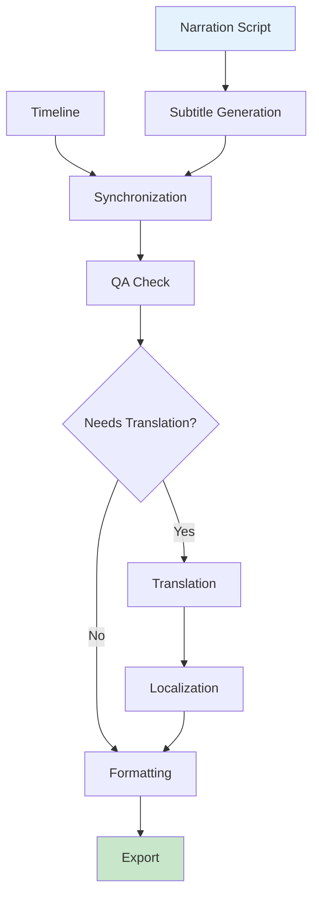

# Subtitle Guide

This document covers the Subtitle Engine in AMRAS.

## Overview

The Subtitle Engine generates, synchronizes, translates, and formats subtitles for video content.

## Architecture



## Modules

### Subtitles Module (`modules/subtitles/`)

| File | Purpose |
|---|---|
| `agents.py` | 6 subtitle agents |
| `engine.py` | Subtitle pipeline |
| `formats.py` | SRT, VTT, ASS export |
| `exceptions.py` | Subtitle errors |

### Agents

| Agent | Purpose |
|---|---|
| `SubtitleGenerationAgent` | Generate subtitles from script |
| `SynchronizationAgent` | Sync with audio timing |
| `TranslationAgent` | Translate subtitles |
| `LocalizationAgent` | Localize for target audience |
| `FormattingAgent` | Apply caption styling |
| `SubtitleQAAgent` | Subtitle quality assurance |

## Pipeline Stages

### 1. Subtitle Generation

Generate subtitles from narration:

```python
from modules.subtitles.agents import SubtitleGenerationAgent

agent = SubtitleGenerationAgent()
result = await agent.execute({
    "script": "The hero arrived at the castle. He drew his sword.",
    "timestamps": [
        {"word": "The", "start": 0.0, "end": 0.2},
        {"word": "hero", "start": 0.2, "end": 0.5},
        ...
    ],
    "max_chars_per_line": 42,
    "max_lines": 2
})

# Returns:
# {
#     "segments": [
#         {"id": 1, "text": "The hero arrived\nat the castle.", "start": 0.0, "end": 2.5},
#         {"id": 2, "text": "He drew his sword.", "start": 2.8, "end": 4.5}
#     ]
# }
```

### 2. Synchronization

Sync subtitles with audio timeline:

```python
from modules.subtitles.agents import SynchronizationAgent

agent = SynchronizationAgent()
result = await agent.execute({
    "segments": [...],
    "audio_timestamps": [...],
    "timeline_sync_points": [...]
})

# Returns:
# {
#     "synced_segments": [
#         {"id": 1, "text": "...", "start": 0.0, "end": 2.5, "confidence": 0.95}
#     ],
#     "adjustments": [
#         {"segment_id": 3, "original": 5.0, "adjusted": 5.2, "reason": "Audio timing"}
#     ]
# }
```

### 3. Translation

Translate subtitles to target language:

```python
from modules.subtitles.agents import TranslationAgent

agent = TranslationAgent()
result = await agent.execute({
    "segments": [...],
    "source_language": "en",
    "target_language": "ja"
})

# Returns:
# {
#     "translated_segments": [
#         {"id": 1, "text": "英雄は城に到着した", "start": 0.0, "end": 2.5}
#     ]
# }
```

### 4. Localization

Adapt subtitles for target audience:

```python
from modules.subtitles.agents import LocalizationAgent

agent = LocalizationAgent()
result = await agent.execute({
    "segments": [...],
    "target_culture": "ja_JP",
    "localization_rules": [...]
})

# Returns:
# {
#     "localized_segments": [...],
#     "adjustments": [
#         {"segment_id": 1, "original": "...", "localized": "...", "reason": "Cultural adaptation"}
#     ]
# }
```

### 5. Formatting

Apply caption styling:

```python
from modules.subtitles.agents import FormattingAgent

agent = FormattingAgent()
result = await agent.execute({
    "segments": [...],
    "style": {
        "font": "Arial",
        "size": 24,
        "color": "white",
        "outline": "black",
        "position": "bottom"
    },
    "format": "srt"
})

# Returns formatted subtitle file content
```

### 6. Subtitle QA

Validate subtitle quality:

```python
from modules.subtitles.agents import SubtitleQAAgent

agent = SubtitleQAAgent()
result = await agent.execute({
    "segments": [...],
    "audio_track": "/storage/audio/narration.wav"
})

# Returns:
# {
#     "quality_score": 0.93,
#     "issues": [],
#     "metrics": {
#         "timing_accuracy": 0.95,
#         "readability": 0.91,
#         "completeness": 0.94
#     }
# }
```

## Engine Orchestration

```python
from modules.subtitles.engine import SubtitleEngine

engine = SubtitleEngine()

result = await engine.run(
    timeline_id="uuid",
    audio_track_id="uuid",
    target_language="en",
    format="srt",
    db_session=session
)

# Result:
# {
#     "subtitle_path": "/storage/subtitles/narration.srt",
#     "segment_count": 45,
#     "quality_score": 0.93
# }
```

## Export Formats

### SRT (SubRip)

```srt
1
00:00:01,000 --> 00:00:03,500
The hero arrived
at the castle.

2
00:00:03,800 --> 00:00:05,500
He drew his sword.
```

### VTT (WebVTT)

```vtt
WEBVTT

1
00:00:01.000 --> 00:00:03.500
The hero arrived
at the castle.

2
00:00:03.800 --> 00:00:05.500
He drew his sword.
```

### ASS (Advanced SubStation Alpha)

```ass
[Script Info]
Title: AMRAS Subtitles
ScriptType: v4.00+

[V4+ Styles]
Format: Name, Fontname, Fontsize, PrimaryColour, ...
Style: Default,Arial,24,&H00FFFFFF,...

[Events]
Format: Layer, Start, End, Style, Name, MarginL, MarginR, MarginV, Effect, Text
Dialogue: 0,0:00:01.00,0:00:03.50,Default,,0,0,0,,The hero arrived\Nat the castle.
```

### Format Functions

```python
from modules.subtitles.formats import export_srt, export_vtt, export_ass

# Export to SRT
srt_content = export_srt(segments)

# Export to VTT
vtt_content = export_vtt(segments)

# Export to ASS
ass_content = export_ass(segments, style_config)
```

## Database Models

| Model | Purpose |
|---|---|
| `SubtitleLanguage` | Supported languages |
| `LocalizationProfile` | Localization settings |
| `CaptionStyle` | Caption formatting |
| `SubtitleJob` | Subtitle generation jobs |
| `SubtitleSegment` | Individual subtitles |
| `TranslationJob` | Translation tracking |
| `SubtitleVersion` | Version history |

## API Endpoints

### Generate Subtitles

```
POST /subtitles/generate
```

**Request:**
```json
{
    "timeline_id": "uuid",
    "audio_track_id": "uuid",
    "format": "srt",
    "language": "en"
}
```

### Export Subtitles

```
POST /subtitles/export/{job_id}
```

**Query Parameters:**
- `format` (string): srt, vtt, or ass

### Get Subtitle Job Status

```
GET /subtitles/jobs/{job_id}
```

### Get Subtitle Segments

```
GET /subtitles/jobs/{job_id}/segments
```

## Supported Languages

| Language | Code |
|---|---|
| English | `en` |
| Japanese | `ja` |
| Korean | `ko` |
| Chinese (Simplified) | `zh-CN` |
| Chinese (Traditional) | `zh-TW` |
| Spanish | `es` |
| French | `fr` |
| German | `de` |
| Portuguese | `pt` |
| Arabic | `ar` |

## Configuration

### Caption Styles

```json
{
    "default": {
        "font": "Arial",
        "size": 24,
        "color": "white",
        "outline": "black",
        "outline_width": 2,
        "position": "bottom",
        "alignment": "center"
    },
    "dramatic": {
        "font": "Impact",
        "size": 28,
        "color": "yellow",
        "outline": "black",
        "position": "bottom"
    }
}
```

## Best Practices

1. **Keep subtitles concise** (max 42 chars per line, 2 lines)
2. **Sync accurately** with audio
3. **Use consistent terminology** across episodes
4. **Test readability** at target resolution
5. **Review QA reports** before export

## Troubleshooting

| Issue | Solution |
|---|---|
| Timing off | Adjust sync points |
| Text cut off | Reduce characters per line |
| Wrong language | Check language code |
| Format errors | Validate export format |
| Low quality score | Review QA suggestions |
