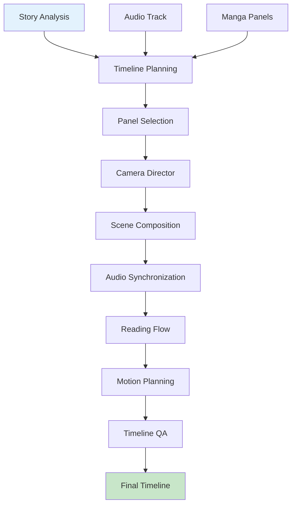

# Timeline Guide

This document covers the Timeline Service in AMRAS.

## Overview

The Timeline Service creates video timelines from story analysis, audio tracks, and visual content, coordinating camera movements, panel selections, and transitions.

## Architecture



## Modules

### Timeline Module (`modules/timeline/`)

| File | Purpose |
|---|---|
| `agents/planning.py` | Timeline planning |
| `agents/panel_selection.py` | Panel selection algorithm |
| `agents/camera_director.py` | Camera movement design |
| `agents/scene_composition.py` | Scene assembly |
| `agents/audio_sync.py` | Audio-visual synchronization |
| `agents/reading_flow.py` | Manga reading flow |
| `agents/motion_planning.py` | Motion path design |
| `agents/quality_assurance.py` | Timeline QA |
| `service.py` | Timeline service API |

### Agents

| Agent | Purpose |
|---|---|
| `TimelinePlanningAgent` | High-level timeline structure |
| `PanelSelectionAgent` | Select panels for each scene |
| `CameraDirectorAgent` | Camera movements (pan, zoom) |
| `SceneCompositionAgent` | Assemble scene elements |
| `AudioSynchronizationAgent` | Sync audio with visuals |
| `ReadingFlowAgent` | Respect manga reading order |
| `MotionPlanningAgent` | Design motion paths |
| `QualityAssuranceAgent` | Validate timeline |

## Pipeline Stages

### 1. Timeline Planning

Create the high-level timeline structure:

```python
from modules.timeline.agents.planning import TimelinePlanningAgent

agent = TimelinePlanningAgent()
result = await agent.execute({
    "story_analysis": {...},
    "audio_duration": 180.0,
    "chapter_pages": 20
})

# Returns:
# {
#     "scenes": [
#         {"id": 1, "description": "Opening scene", "duration": 15.0},
#         {"id": 2, "description": "Battle scene", "duration": 45.0},
#         {"id": 3, "description": "Resolution", "duration": 20.0}
#     ],
#     "total_duration": 180.0,
#     "scene_count": 3
# }
```

### 2. Panel Selection

Select the best panels for each scene:

```python
from modules.timeline.agents.panel_selection import PanelSelectionAgent

agent = PanelSelectionAgent()
result = await agent.execute({
    "scene": {"id": 1, "description": "Opening scene"},
    "available_panels": [...],
    "duration": 15.0
})

# Returns:
# {
#     "selected_panels": [
#         {"panel_id": 1, "start_time": 0.0, "end_time": 5.0, "relevance": 0.95},
#         {"panel_id": 3, "start_time": 5.0, "end_time": 10.0, "relevance": 0.88},
#         {"panel_id": 5, "start_time": 10.0, "end_time": 15.0, "relevance": 0.92}
#     ]
# }
```

### 3. Camera Direction

Design camera movements:

```python
from modules.timeline.agents.camera_director import CameraDirectorAgent

agent = CameraDirectorAgent()
result = await agent.execute({
    "panel": {"id": 1, "bbox": [0, 0, 1920, 1080]},
    "duration": 5.0,
    "scene_type": "establishing"
})

# Returns:
# {
#     "camera_path": {
#         "type": "zoom_in",
#         "start": {"x": 960, "y": 540, "zoom": 1.0},
#         "end": {"x": 700, "y": 400, "zoom": 1.3},
#         "easing": "ease_in_out"
#     }
# }
```

### 4. Scene Composition

Assemble scene elements:

```python
from modules.timeline.agents.scene_composition import SceneCompositionAgent

agent = SceneCompositionAgent()
result = await agent.execute({
    "scene": {...},
    "panels": [...],
    "camera_paths": [...],
    "transitions": [...]
})

# Returns:
# {
#     "composition": {
#         "scenes": [...],
#         "transitions": [...],
#         "total_duration": 180.0
#     }
# }
```

### 5. Audio Synchronization

Sync audio with visual content:

```python
from modules.timeline.agents.audio_sync import AudioSynchronizationAgent

agent = AudioSynchronizationAgent()
result = await agent.execute({
    "timeline": {...},
    "audio_track": "/storage/audio/narration.wav",
    "timestamps": [...]
})

# Returns:
# {
#     "sync_points": [
#         {"time": 0.0, "panel_id": 1, "audio_offset": 0.0},
#         {"time": 5.0, "panel_id": 3, "audio_offset": 5.2}
#     ]
# }
```

### 6. Reading Flow

Respect manga reading order:

```python
from modules.timeline.agents.reading_flow import ReadingFlowAgent

agent = ReadingFlowAgent()
result = await agent.execute({
    "panels": [...],
    "reading_direction": "right_to_left"
})

# Returns:
# {
#     "ordered_panels": [...],
#     "flow_adjustments": [
#         {"panel_id": 5, "order": 2, "reason": "Reading direction correction"}
#     ]
# }
```

### 7. Motion Planning

Design motion paths:

```python
from modules.timeline.agents.motion_planning import MotionPlanningAgent

agent = MotionPlanningAgent()
result = await agent.execute({
    "scene": {...},
    "animation_style": "dynamic"
})

# Returns:
# {
#     "motion_paths": [
#         {"type": "ken_burns", "params": {...}, "panel_id": 1},
#         {"type": "pan_right", "params": {...}, "panel_id": 3}
#     ]
# }
```

### 8. Timeline QA

Validate the complete timeline:

```python
from modules.timeline.agents.quality_assurance import QualityAssuranceAgent

agent = QualityAssuranceAgent()
result = await agent.execute({
    "timeline": {...}
})

# Returns:
# {
#     "quality_score": 0.91,
#     "issues": [],
#     "suggestions": ["Consider shorter transition in scene 2"]
# }
```

## Service API

The `TimelineService` provides a high-level interface:

```python
from modules.timeline.service import TimelineService

service = TimelineService()

# Generate timeline
timeline = await service.generate(
    manga_id=1,
    chapter_ids=[1, 2, 3],
    audio_track_id="uuid",
    db_session=session
)

# Get timeline
timeline = await service.get(timeline_id="uuid")

# Get scenes
scenes = await service.get_scenes(timeline_id="uuid")

# Get cameras
cameras = await service.get_cameras(timeline_id="uuid")

# Get transitions
transitions = await service.get_transitions(timeline_id="uuid")

# Rebuild timeline
timeline = await service.rebuild(timeline_id="uuid", config={...})

# Get status
status = await service.status(timeline_id="uuid")
```

## Database Models

| Model | Purpose |
|---|---|
| `AnimationProfile` | Animation settings |
| `Timeline` | Video timelines |
| `Transition` | Scene transitions |
| `SceneMetadata` | Scene information |
| `TimelineScene` | Timeline scenes |
| `CameraPath` | Camera movements |
| `TimelinePanel` | Panel assignments |
| `Synchronization` | Audio-visual sync |

## Transition Types

| Type | Description |
|---|---|
| `fade` | Cross-fade between scenes |
| `dissolve` | Dissolve effect |
| `wipe_left` | Horizontal wipe left |
| `wipe_right` | Horizontal wipe right |
| `cut` | Hard cut |

## Camera Movements

| Type | Description |
|---|---|
| `zoom_in` | Gradual zoom in |
| `zoom_out` | Gradual zoom out |
| `pan_left` | Horizontal pan left |
| `pan_right` | Horizontal pan right |
| `ken_burns` | Combined zoom and pan |
| `static` | No movement |

## API Endpoints

### Generate Timeline

```
POST /timeline/generate
```

### Get Timeline

```
GET /timeline/{timeline_id}
```

### Get Scenes

```
GET /timeline/{timeline_id}/scenes
```

### Get Cameras

```
GET /timeline/{timeline_id}/cameras
```

### Get Transitions

```
GET /timeline/{timeline_id}/transitions
```

## Configuration

The timeline service uses the default AI provider and video settings.

### Video Settings

```env
VIDEO__RESOLUTION=1920x1080
VIDEO__FPS=30
```

## Best Practices

1. **Respect reading direction** for manga
2. **Sync with audio** for engaging content
3. **Use appropriate transitions** for scene mood
4. **Review QA reports** before rendering
5. **Test timeline** with preview before full render

## Troubleshooting

| Issue | Solution |
|---|---|
| Panels out of order | Check reading direction setting |
| Audio sync off | Review sync points |
| Poor transitions | Adjust transition parameters |
| Timeline too long | Reduce scene durations |
