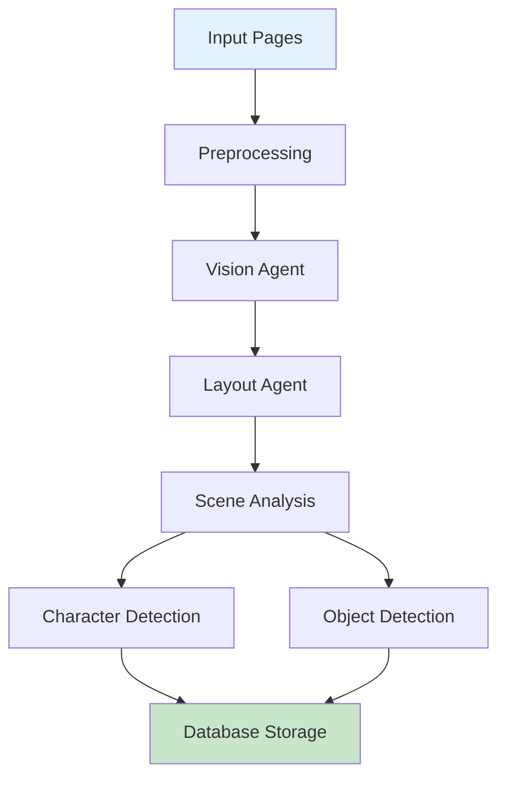

# Vision Pipeline Guide

This document covers the Vision Pipeline in AMRAS.

## Overview

The Vision Pipeline analyzes manga pages to detect panels, characters, objects, scenes, and layout information.

## Architecture



## Modules

### Vision Module (`modules/vision/`)

| File | Purpose |
|---|---|
| `agents/vision_agent.py` | Main vision analysis |
| `pipeline.py` | Vision pipeline orchestration |
| `preprocessing.py` | Image preprocessing |

### Agents

| Agent | Purpose |
|---|---|
| `VisionAgent` | Core vision analysis |
| `LayoutAgent` | Layout and panel detection |
| `CharacterDetectionAgent` | Character recognition |
| `SceneAnalysisAgent` | Scene understanding |

## Pipeline Stages

### 1. Preprocessing

Prepare images for analysis:

```python
from modules.vision.preprocessing import preprocess_image

preprocessed = preprocess_image("/path/to/page.png", {
    "deskew": True,
    "denoise": True,
    "contrast": True,
    "threshold": False,
    "orientation": True,
    "normalize": True
})
```

#### Preprocessing Steps

| Step | Description |
|---|---|
| Deskew | Correct rotation |
| Denoise | Remove noise |
| Contrast | Enhance contrast |
| Threshold | Binarize image |
| Orientation | Correct orientation |
| Normalize | Standardize dimensions |

### 2. Vision Analysis

Detect panels and layout:

```python
from modules.vision.agents.vision_agent import VisionAgent

agent = VisionAgent()
result = await agent.execute({
    "page_id": 123,
    "image_path": "/storage/manga/ch1/page_05.png"
})

# Returns:
# {
#     "panels": [
#         {"bbox": [100, 50, 400, 300], "confidence": 0.95},
#         {"bbox": [450, 50, 750, 300], "confidence": 0.92}
#     ],
#     "text_regions": [...],
#     "layout": "2x1_grid"
# }
```

### 3. Layout Analysis

Understand page layout:

```python
from modules.vision.agents.vision_agent import LayoutAgent

agent = LayoutAgent()
result = await agent.execute({
    "panels": [...],
    "page_image": "..."
})

# Returns:
# {
#     "layout_type": "2x1_grid",
#     "reading_order": [0, 1],
#     "panel_relationships": [...]
# }
```

### 4. Character Detection

Identify characters in panels:

```python
from modules.vision.agents.vision_agent import CharacterDetectionAgent

agent = CharacterDetectionAgent()
result = await agent.execute({
    "panel": {"id": 1, "image_path": "..."},
    "known_characters": [...]
})

# Returns:
# {
#     "characters": [
#         {
#             "name": "Goku",
#             "bbox": [120, 80, 280, 250],
#             "confidence": 0.88,
#             "appearance": "orange gi, black hair"
#         }
#     ]
# }
```

### 5. Scene Analysis

Understand scene context:

```python
from modules.vision.agents.vision_agent import SceneAnalysisAgent

agent = SceneAnalysisAgent()
result = await agent.execute({
    "page_id": 123,
    "panels": [...],
    "ocr_text": [...]
})

# Returns:
# {
#     "scenes": [
#         {
#             "panel_id": 1,
#             "description": "Goku training in the wilderness",
#             "mood": "determined",
#             "location": "wilderness",
#             "time_of_day": "day"
#         }
#     ]
# }
```

### 6. Object Detection

Identify objects in panels:

```python
# Object detection is part of VisionAgent
result = await vision_agent.execute({...})

# Returns additional:
# {
#     "objects": [
#         {"label": "sword", "bbox": [...], "confidence": 0.90},
#         {"label": "tree", "bbox": [...], "confidence": 0.85}
#     ]
# }
```

## Pipeline Orchestration

The `VisionPipeline` runs all stages:

```python
from modules.vision.pipeline import VisionPipeline

pipeline = VisionPipeline()

result = await pipeline.run(
    page_ids=[1, 2, 3],
    db_session=session
)

# Returns:
# {
#     "pages_analyzed": 3,
#     "panels_detected": 12,
#     "characters_found": 5,
#     "objects_detected": 25
# }
```

## Database Models

| Model | Purpose |
|---|---|
| `VisionJob` | Vision analysis job |
| `Panel` | Detected panels |
| `SpeechBubble` | Detected speech bubbles |
| `Narration` | Narration text |
| `CharacterDetected` | Detected characters |
| `ObjectDetected` | Detected objects |
| `ActionDetected` | Detected actions |
| `SoundEffect` | Detected sound effects |
| `ConfidenceScore` | Quality scores |

## API Endpoints

### Analyze Page

```
POST /vision/analyze
```

**Request:** Multipart form data with image

### Get Analysis Results

```
GET /vision/results/{job_id}
```

## Configuration

The vision pipeline uses the default AI provider and GPU settings.

```env
GPU__ENABLED=true
GPU__DEVICE=cuda
```

## Best Practices

1. **Preprocess images** for better detection
2. **Use known character references** for identification
3. **Review confidence scores** for accuracy
4. **Process pages sequentially** for consistent results

## Troubleshooting

| Issue | Solution |
|---|---|
| Poor detection | Improve image preprocessing |
| Wrong characters | Provide character references |
| Slow processing | Enable GPU acceleration |
| Memory issues | Process fewer pages at once |
