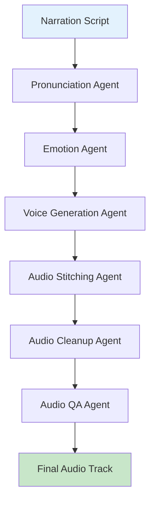

# Voice Guide

This document covers the Voice Synthesis pipeline in AMRAS.

## Overview

The Voice Engine converts narration scripts into emotion-aware audio tracks using text-to-speech technology.

## Architecture



## Modules

### Voice Module (`modules/voice/`)

| File | Purpose |
|---|---|
| `agents.py` | 7 voice synthesis agents |
| `engine.py` | Audio production engine |
| `exceptions.py` | Voice-specific errors |

### Agents

| Agent | Purpose |
|---|---|
| `VoiceGenerationAgent` | Core TTS generation |
| `EmotionAgent` | Emotion analysis for voice |
| `AudioTimingAgent` | Timing alignment |
| `AudioStitchingAgent` | Segment concatenation |
| `AudioCleanupAgent` | Audio post-processing |
| `VoiceQAAgent` | Audio quality assurance |
| `PronunciationAgent` | Pronunciation mapping |

## Pipeline Stages

### 1. Pronunciation Mapping

Map text to phonemes for correct pronunciation:

```python
from modules.voice.agents import PronunciationAgent

agent = PronunciationAgent()
result = await agent.execute({
    "text": "Goku uses Kamehameha",
    "language": "en"
})

# Returns:
# {
#     "phonemes": [
#         {"word": "Goku", "phonemes": ["G", "OW", "K", "UW"]},
#         {"word": "Kamehameha", "phonemes": ["K", "AA", "M", "EY", "HH", "AA", "M", "EY", "HH", "AA"]}
#     ],
#     "custom_rules": {"Kamehameha": "kah-meh-HAH-meh-hah"}
# }
```

### 2. Emotion Analysis

Determine emotional tone for each segment:

```python
from modules.voice.agents import EmotionAgent

agent = EmotionAgent()
result = await agent.execute({
    "text": "I won't let you hurt my friends!",
    "context": "battle_scene",
    "character": "goku"
})

# Returns:
# {
#     "emotion": "determined",
#     "intensity": 0.8,
#     "pace": "fast",
#     "volume": "loud"
# }
```

### 3. Voice Generation

Generate audio from text with emotion parameters:

```python
from modules.voice.agents import VoiceGenerationAgent

agent = VoiceGenerationAgent()
result = await agent.execute({
    "text": "I won't let you hurt my friends!",
    "voice_profile": "goku_voice",
    "emotion": {
        "emotion": "determined",
        "intensity": 0.8
    },
    "pronunciation": {...}
})

# Returns:
# {
#     "audio_path": "/tmp/segment_001.wav",
#     "duration": 2.5,
#     "word_timestamps": [...]
# }
```

### 4. Audio Stitching

Concatenate audio segments into a complete track:

```python
from modules.voice.agents import AudioStitchingAgent

agent = AudioStitchingAgent()
result = await agent.execute({
    "segments": [
        {"path": "/tmp/segment_001.wav", "gap_after": 0.5},
        {"path": "/tmp/segment_002.wav", "gap_after": 0.3},
        {"path": "/tmp/segment_003.wav", "gap_after": 0.0}
    ],
    "crossfade": 0.1
})

# Returns:
# {
#     "audio_path": "/tmp/narration_full.wav",
#     "total_duration": 15.2,
#     "segment_boundaries": [...]
# }
```

### 5. Audio Cleanup

Post-process the audio:

```python
from modules.voice.agents import AudioCleanupAgent

agent = AudioCleanupAgent()
result = await agent.execute({
    "audio_path": "/tmp/narration_full.wav",
    "operations": ["normalize", "denoise", "eq"]
})

# Returns:
# {
#     "audio_path": "/storage/audio/narration_final.wav",
#     "peak_level": -3.0,
#     "rms_level": -18.0
# }
```

### 6. Audio QA

Validate audio quality:

```python
from modules.voice.agents import VoiceQAAgent

agent = VoiceQAAgent()
result = await agent.execute({
    "audio_path": "/storage/audio/narration_final.wav",
    "script": "Original narration text..."
})

# Returns:
# {
#     "quality_score": 0.94,
#     "issues": [],
#     "metrics": {
#         "clarity": 0.95,
#         "emotion_match": 0.92,
#         "pacing": 0.96
#     }
# }
```

## Engine Orchestration

The `AudioProductionEngine` runs the full pipeline:

```python
from modules.voice.engine import AudioProductionEngine

engine = AudioProductionEngine()

result = await engine.run(
    script_id=123,
    voice_profile="narrator_1",
    db_session=session
)

# Result:
# {
#     "audio_path": "/storage/audio/narration_final.wav",
#     "duration": 180.5,
#     "segments": 45,
#     "quality_score": 0.94,
#     "timestamps": [...]
# }
```

## Voice Profiles

Voice profiles define the speaker characteristics:

```python
# Create voice profile
POST /audio/profiles
{
    "name": "narrator_1",
    "provider": "elevenlabs",
    "voice_id": "21m00Tcm4TlvDq8ikWAM",
    "parameters": {
        "stability": 0.6,
        "similarity_boost": 0.8,
        "style": 0.4
    }
}
```

### Default Profiles

| Profile | Description |
|---|---|
| `narrator_1` | Neutral narrator voice |
| `narrator_dramatic` | Dramatic narration |
| `character_young` | Young character voice |
| `character_mature` | Mature character voice |

## Database Models

| Model | Purpose |
|---|---|
| `VoiceProfile` | Voice configurations |
| `AudioJob` | Audio generation jobs |
| `AudioSegment` | Individual segments |
| `PronunciationDictionary` | Pronunciation rules |
| `TimestampIndex` | Word timestamps |
| `AudioVersion` | Version history |
| `AudioQualityReport` | Quality metrics |

## API Endpoints

### Generate Audio

```
POST /audio/generate
```

**Request:**
```json
{
    "script_id": 123,
    "voice_profile": "narrator_1",
    "emotion_override": null
}
```

### Get Audio Job Status

```
GET /audio/jobs/{job_id}
```

### List Voice Profiles

```
GET /audio/profiles
```

### Get Audio Segments

```
GET /audio/jobs/{job_id}/segments
```

## Pronunciation Dictionary

Custom pronunciation rules:

```python
# Add pronunciation
POST /audio/pronunciations
{
    "word": "Kamehameha",
    "phonemes": "k aa m ey hh aa m ey hh aa",
    "language": "en"
}
```

## Configuration

### Environment Variables

```env
AI__PROVIDER=elevenlabs
AI__API_KEY=your-api-key
```

### TTS Providers

| Provider | Quality | Speed | Cost |
|---|---|---|---|
| Local | Medium | Fast | Free |
| ElevenLabs | High | Medium | Paid |
| Azure | High | Medium | Paid |
| Mock | N/A | Instant | Free |

## Best Practices

1. **Use pronunciation dictionary** for character names
2. **Set emotion parameters** for engaging narration
3. **Review QA reports** before using audio
4. **Version audio** for rollback capability
5. **Batch segments** for faster processing

## Troubleshooting

| Issue | Solution |
|---|---|
| Poor pronunciation | Add to pronunciation dictionary |
| Wrong emotion | Adjust emotion parameters |
| Audio artifacts | Run audio cleanup |
| Slow generation | Use batch processing |
| Provider errors | Check API key and health |
